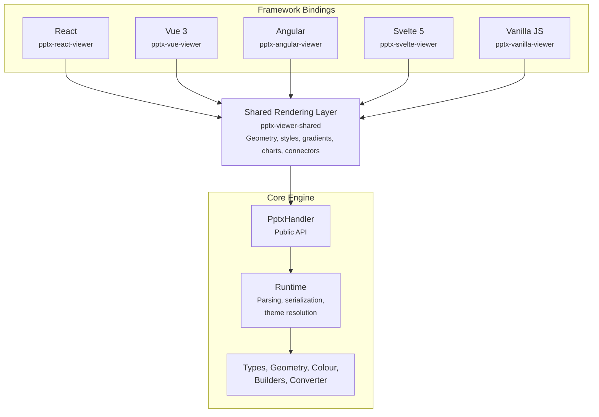
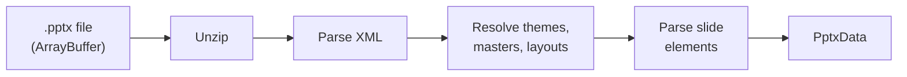
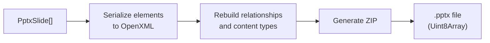

# Architecture

`pptx-viewer` is a layered system. Framework bindings (React, Vue 3, Angular, Svelte, and a plain-DOM vanilla JS binding) handle the UI; a shared rendering layer provides framework-agnostic logic; and the core engine handles everything related to parsing, editing, and saving PowerPoint files. Each layer depends only on the one below it.

## Overview

## Framework bindings

The binding packages are thin presentation layers. They consume pre-computed rendering data from `pptx-viewer-shared` and translate it into framework-specific templates (JSX, Vue SFCs, Angular components, Svelte 5 runes, or plain DOM calls for the vanilla binding). Slides render as scaled HTML/SVG with CSS transforms, giving sharp text at any zoom, native accessibility, and full DOM interactivity.

Each binding exposes a top-level viewer/editor entry point that orchestrates state, editing, loading, export, and presentation mode through the idiom native to its framework: composable hooks in React, composables in Vue, services in Angular, runes in Svelte, and a plain factory function plus imperative instance API in vanilla JS. Because they all consume the same shared layer, the rendering output is identical across all five.

## Shared rendering layer

Most of the rendering logic is not framework-specific: geometry calculations, style/colour/gradient resolution, text and paragraph building, chart axis maths, connector routing, and export data preparation. All of this lives in `pptx-viewer-shared` and is imported identically by every binding. This ensures feature parity across React, Vue, Angular, Svelte, and vanilla JS without duplicating code.

## Core engine (`pptx-viewer-core`)

The core package is entirely framework-agnostic. It runs in any JavaScript environment: browser, Node.js, Web Worker, or serverless function. Its public entry point is `PptxHandler`.

Internally the engine is composed from many focused modules, each responsible for one concern (e.g. parsing a specific element type, resolving theme colours, serializing relationships). This modular design keeps each piece isolated and testable.

### How loading works

1. The `.pptx` file (a ZIP archive) is opened in memory.
2. XML parts are parsed into JavaScript objects.
3. Themes, slide masters, and layouts are resolved to build the style inheritance chain.
4. Each slide's shape tree is parsed into typed element objects.
5. The result is a structured [`PptxData`](/guide/data-model) model you can inspect, edit, and render.

Password-protected files are detected and decrypted automatically when a password is provided.

### How saving works

Saving reverses the load process: elements are serialized back to OpenXML, relationships and content types are rebuilt, and the result is packaged into a valid `.pptx` ZIP archive.

## Key design decisions

| Decision                             | Rationale                                                                                                                                                                             |
| ------------------------------------ | ------------------------------------------------------------------------------------------------------------------------------------------------------------------------------------- |
| **CSS-based rendering** (not Canvas) | Sharp text at any zoom, native accessibility, DOM interactivity, and standard CSS styling.                                                                                            |
| **Modular engine**                   | Many small, focused modules keep each concern isolated and testable. New capabilities (including new element types) are added as new modules.                                         |
| **Discriminated union for elements** | TypeScript narrows to the correct element type via the `type` field, giving full type safety with no casting.                                                                         |
| **Theme resolution chain**           | Element, Placeholder, Layout, Master, Theme mirrors PowerPoint's own style inheritance.                                                                                               |
| **EMU units internally**             | PowerPoint uses English Metric Units (1 inch = 914,400 EMU). Parsed elements expose approximate pixel values for convenience; exact EMU values are preserved for round-trip fidelity. |

## Related reading

- [The PptxData Model](/guide/data-model) - the full shape of a parsed presentation, element types, and units.
- [Core package overview](/core/) - the public API reference.
