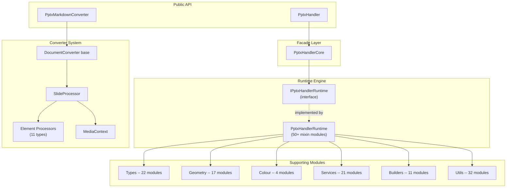
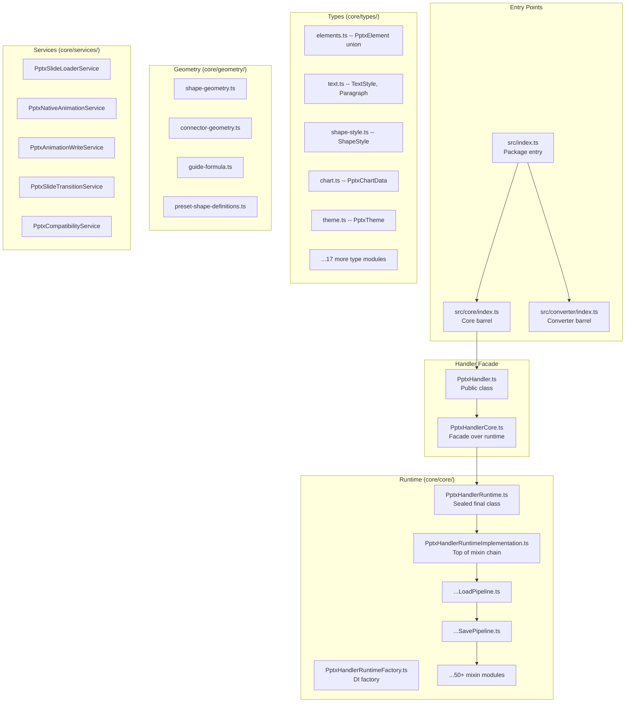
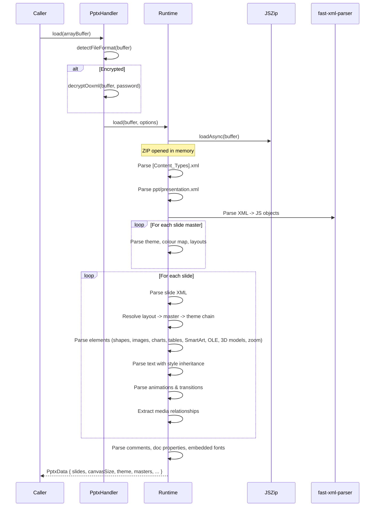
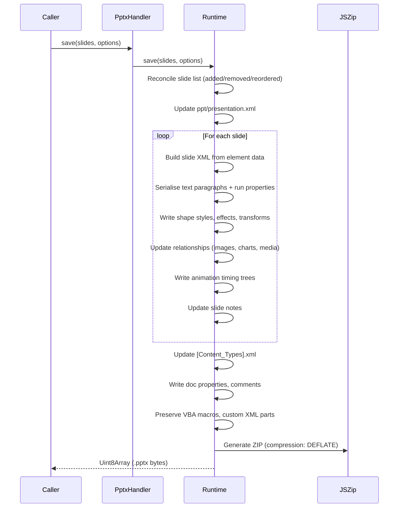
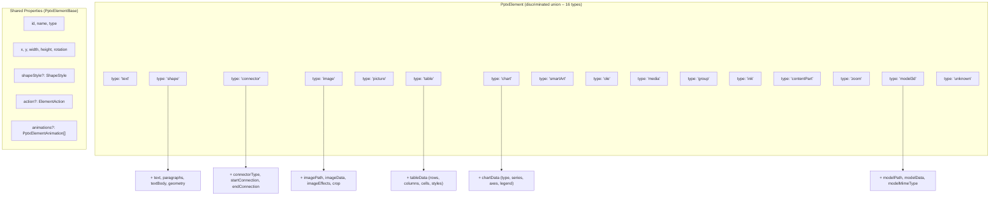
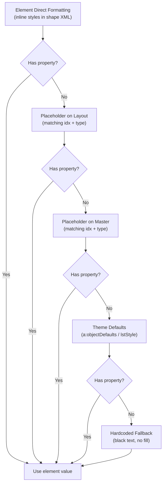
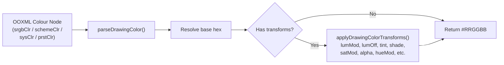
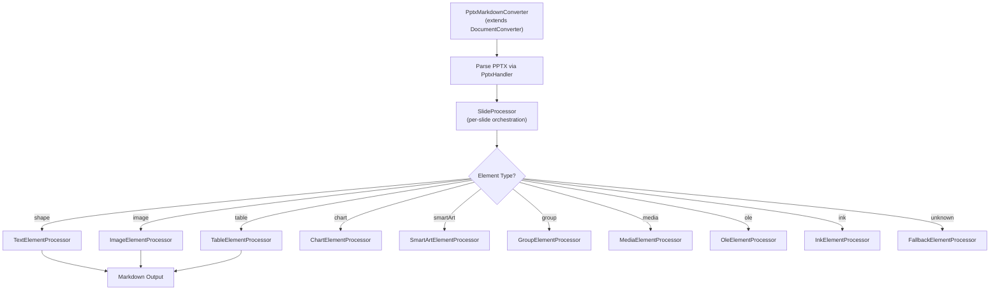

# pptx-viewer-core

A framework-agnostic TypeScript engine for **parsing**, **editing**, **serialising**, and **converting** PowerPoint (.pptx) files. Operates entirely in-memory on the OpenXML ZIP archive with no native dependencies.

## Table of Contents

- [pptx-viewer-core](#pptx-viewer-core)
  - [Table of Contents](#table-of-contents)
  - [Overview](#overview)
  - [Quick Start](#quick-start)
  - [API Reference](#api-reference)
    - [PptxHandler](#pptxhandler)
    - [PptxMarkdownConverter](#pptxmarkdownconverter)
    - [PptxXmlBuilder (Fluent API)](#pptxxmlbuilder-fluent-api)
  - [Architecture](#architecture)
    - [High-Level Architecture](#high-level-architecture)
    - [Module Map](#module-map)
    - [Load Pipeline](#load-pipeline)
    - [Save Pipeline](#save-pipeline)
    - [Runtime Mixin Composition](#runtime-mixin-composition)
  - [Deep Dive: How It Works](#deep-dive-how-it-works)
    - [1. OpenXML ZIP Structure](#1-openxml-zip-structure)
    - [2. Type System](#2-type-system)
    - [3. Theme Resolution Chain](#3-theme-resolution-chain)
    - [4. Geometry Engine](#4-geometry-engine)
    - [5. Colour Processing](#5-colour-processing)
    - [6. Converter System](#6-converter-system)
    - [7. Services Layer](#7-services-layer)
    - [8. Builder APIs](#8-builder-apis)
    - [9. Encryption and Security](#9-encryption-and-security)
  - [Type System Reference](#type-system-reference)
  - [Feature Summary](#feature-summary)
  - [File Structure Reference](#file-structure-reference)
  - [Limitations](#limitations)

---

## Overview

PowerPoint files (.pptx) are ZIP archives containing XML documents conforming to the [Office Open XML (OOXML)](https://www.ecma-international.org/publications-and-standards/standards/ecma-376/) specification. This package provides a complete TypeScript SDK for working with those files:

| Capability | Description |
|------------|-------------|
| **Parse** | Unzip, parse XML, and extract slides, elements, themes, masters, layouts, media, charts, SmartArt, comments, animations, transitions, and document properties |
| **Edit** | Mutate the in-memory data model (add/remove/reorder slides, insert elements, modify text, change styles, update themes) |
| **Save** | Serialise the modified data model back into a valid .pptx ZIP archive with full round-trip fidelity |
| **Convert** | Transform parsed PPTX data into Markdown with optional media extraction |
| **Export** | Export individual slides as standalone .pptx files |
| **Encrypt/Decrypt** | Handle password-protected PPTX files using AES-128/256 Agile encryption |

The library has only two peer dependencies: **jszip** (ZIP handling) and **fast-xml-parser** (XML parse/build).

---

## Quick Start

```typescript
import { PptxHandler } from "pptx-viewer-core";

// 1. Parse a PPTX file
const handler = new PptxHandler();
const buffer = await fetch("presentation.pptx").then(r => r.arrayBuffer());
const data = await handler.load(buffer);

console.log(`${data.slides.length} slides loaded`);
console.log(`Canvas: ${data.canvasSize.width} x ${data.canvasSize.height}`);

// 2. Modify slides
data.slides[0].elements[0].text = "Updated title";

// 3. Save back to .pptx
const outputBytes = await handler.save(data.slides);
// => Uint8Array of a valid .pptx file

// 4. Export individual slides
const exports = await handler.exportSlides(data.slides, {
  slideIndexes: [0, 2],
});
// => Map<number, Uint8Array>
```

### PPTX to Markdown conversion

```typescript
import { PptxMarkdownConverter } from "pptx-viewer-core";

const converter = new PptxMarkdownConverter({
  includeMetadata: true,
  includeSlideNumbers: true,
  imageHandling: "extract",
});

const markdown = await converter.convert(buffer, {
  outputPath: "output.md",
  mediaFolderName: "media",
  includeMetadata: true,
}, fileSystemAdapter);
// => ConversionResult with markdown string + extracted media stats
```

---

## API Reference

### PptxHandler

The primary facade for loading, editing, and saving PPTX files.

| Method | Signature | Description |
|--------|-----------|-------------|
| `load` | `(data: ArrayBuffer, options?) => Promise<PptxData>` | Parse a .pptx buffer into structured data |
| `save` | `(slides: PptxSlide[], options?) => Promise<Uint8Array>` | Serialise slides back to .pptx bytes |
| `exportSlides` | `(slides, options) => Promise<Map<number, Uint8Array>>` | Export selected slides as standalone files |
| `getImageData` | `(path: string) => Promise<string \| undefined>` | Get base64 data URL for an embedded image |
| `getMediaArrayBuffer` | `(path: string) => Promise<ArrayBuffer \| undefined>` | Get raw bytes for an embedded media file |
| `getChartDataForGraphicFrame` | `(slidePath, xmlObj) => Promise<PptxChartData \| undefined>` | Extract chart data from a graphic frame |
| `getSmartArtDataForGraphicFrame` | `(slidePath, xmlObj) => Promise<PptxSmartArtData \| undefined>` | Extract SmartArt data from a graphic frame |
| `getLayoutOptions` | `() => PptxLayoutOption[]` | Get available slide layout options |
| `getCompatibilityWarnings` | `() => PptxCompatibilityWarning[]` | Get warnings about unsupported features |
| `createXmlBuilder` / `Builder` | `(data: PptxData) => PptxXmlBuilder` | Create a fluent XML builder |
| `applyTheme` | `(colors, fonts, name?) => Promise<void>` | Apply a complete theme |
| `updateThemeColorScheme` | `(scheme) => Promise<void>` | Modify theme colours |
| `updateThemeFontScheme` | `(scheme) => Promise<void>` | Modify theme fonts |
| `setPresentationTheme` | `(path, applyToAll?) => Promise<void>` | Load a .thmx theme file |

### PptxMarkdownConverter

Converts PPTX files to Markdown documents. Extends the abstract `DocumentConverter` base class.

| Method | Signature | Description |
|--------|-----------|-------------|
| `convert` | `(buffer, options, fs?) => Promise<ConversionResult>` | Convert PPTX buffer to Markdown |

Requires a `FileSystemAdapter` for disk output:

```typescript
interface FileSystemAdapter {
  writeFile(path: string, content: string): Promise<void>;
  writeBinaryFile(path: string, data: Uint8Array): Promise<void>;
  createFolder(path: string): Promise<void>;
}
```

### PptxXmlBuilder (Fluent API)

A chainable builder for constructing OpenXML nodes directly in the runtime's in-memory ZIP.

```typescript
const builder = handler.Builder(data);
// Use fluent methods to construct and insert XML elements
```

---

## Architecture

### High-Level Architecture

The package follows a layered architecture with clear separation of concerns:



### Module Map



### Load Pipeline

When `handler.load(buffer)` is called, the following sequence occurs:



### Save Pipeline

When `handler.save(slides)` is called:



### Runtime Mixin Composition

The runtime is assembled from 50+ mixin modules using a linear inheritance chain. Each module adds a focused set of capabilities:

```mermaid
graph LR
    A["State<br/>(base fields)"] --> B["ThemeLoading"]
    B --> C["ThemeProcessing"]
    C --> D["ThemeOverrides"]
    D --> E["SlideMasters"]
    E --> F["BackgroundParsing"]
    F --> G["ElementParsing"]
    G --> H["ShapeParsing"]
    H --> I["TextParsing"]
    I --> J["ChartParsing"]
    J --> K["...30+ more"]
    K --> L["SavePipeline"]
    L --> M["LoadPipeline"]
    M --> N["Implementation<br/>(top of chain)"]
```



Each file exports a class named `PptxHandlerRuntime` that extends the previous module's export, adding its own methods. The final `PptxHandlerRuntimeImplementation` aggregates all functionality into the complete runtime.

---

## Deep Dive: How It Works

### 1. OpenXML ZIP Structure

A .pptx file is a ZIP archive with this internal structure:

```
presentation.pptx (ZIP)
+-- [Content_Types].xml          <- MIME type registry
+-- _rels/.rels                  <- Root relationships
+-- docProps/
|   +-- app.xml                  <- Application properties
|   +-- core.xml                 <- Dublin Core metadata
|   +-- custom.xml               <- Custom properties
+-- ppt/
    +-- presentation.xml         <- Slide list, canvas size, slide master refs
    +-- presProps.xml             <- Presentation properties (show type, loop, etc.)
    +-- viewProps.xml             <- View state (zoom, grid, guides)
    +-- tableStyles.xml           <- Table style definitions
    +-- _rels/presentation.xml.rels
    +-- theme/
    |   +-- theme1.xml           <- Colour scheme, fonts, format scheme
    +-- slideMasters/
    |   +-- slideMaster1.xml     <- Master slide (background, placeholders)
    +-- slideLayouts/
    |   +-- slideLayout1.xml     <- Layout templates
    +-- slides/
    |   +-- slide1.xml           <- Slide content (shape tree)
    |   +-- _rels/slide1.xml.rels <- Per-slide relationships
    +-- media/
    |   +-- image1.png           <- Embedded images
    |   +-- video1.mp4           <- Embedded media
    |   +-- model1.glb           <- 3D models
    +-- charts/
    |   +-- chart1.xml           <- Chart definitions
    +-- notesSlides/
    |   +-- notesSlide1.xml      <- Speaker notes
    +-- diagrams/                <- SmartArt data
    +-- embeddings/              <- OLE embedded files
    +-- customXml/               <- Custom XML parts
    +-- vbaProject.bin           <- VBA macros (if present)
```

The runtime uses **jszip** to read/write this archive and **fast-xml-parser** to parse/build the XML documents.

### 2. Type System

The type system is organised into 22 domain-specific modules with a discriminated union pattern for elements:



**Key type modules:**

| Module | Types |
|--------|-------|
| `common.ts` | `XmlObject`, `PptxData`, `PptxSlide`, `PptxCanvasSize` |
| `elements.ts` | `PptxElement` discriminated union (16 variants) |
| `element-base.ts` | `PptxElementBase` shared properties |
| `text.ts` | `TextStyle`, `ParagraphStyle`, `TextSegment`, `TextBody` |
| `shape-style.ts` | `ShapeStyle`, `FillStyle`, `StrokeStyle`, `ShadowEffect` |
| `table.ts` | `TableData`, `TableCell`, `TableRow`, `TableBorderStyle` |
| `chart.ts` | `PptxChartData`, `ChartSeries`, `ChartAxis` (23 chart types) |
| `theme.ts` | `PptxTheme`, `PptxThemeColorScheme`, `PptxThemeFontScheme` |
| `animation.ts` | `PptxElementAnimation`, `PptxAnimationPreset` |
| `transition.ts` | `PptxSlideTransition` (42 transition types) |
| `masters.ts` | `PptxSlideMaster`, `PptxSlideLayout` |
| `image.ts` | `ImageEffects`, `ImageCrop` |
| `geometry.ts` | `PptxCustomGeometry`, `GeometryPath` |
| `smart-art.ts` | `PptxSmartArtData`, `SmartArtNode` |
| `media.ts` | `PptxMediaData`, `MediaTiming`, `MediaBookmark`, `MediaCaptionTrack` |
| `metadata.ts` | `CoreProperties`, `AppProperties` |
| `three-d.ts` | `ThreeDProperties`, `BevelType` |
| `type-guards.ts` | Runtime type guard functions for PptxElement variants |

### 3. Theme Resolution Chain

PowerPoint elements inherit visual styles through a multi-level chain. The runtime resolves styles in this order:



**Theme colour references** (e.g. `accent1`, `dk1`, `lt2`) are resolved through the theme's `a:clrScheme`, optionally overridden by the slide master's `p:clrMap` and the layout's `p:clrMapOvr`.

The engine ships with **8 built-in theme presets** and supports runtime theme switching with layout switching and placeholder remapping.

### 4. Geometry Engine

The geometry module (17 files) handles shape path generation and coordinate transforms:

| Module | Purpose |
|--------|---------|
| `shape-geometry.ts` | Main entry -- resolves shape type, clip path, image masks |
| `connector-geometry.ts` | Connector routing and path generation |
| `guide-formula.ts` | OOXML DrawingML guide formula evaluator |
| `guide-formula-eval.ts` | Mathematical expression evaluation engine |
| `guide-formula-paths.ts` | SVG path generation from guide-computed coordinates |
| `preset-shape-definitions.ts` | 187+ preset shape definitions (rect, arrow, star, etc.) |
| `preset-shape-paths.ts` | Pre-computed SVG clip paths for all preset shapes |
| `transform-utils.ts` | Element position/rotation/flip transforms |
| `custom-geometry.ts` | Arbitrary OOXML `<a:custGeom>` path parsing |

**Guide formula evaluation** implements the OOXML DrawingML formula language:

```
+-----------------------------------------------------+
|  Guide Formula Language                              |
|                                                      |
|  Operators: +/-, */div, val, abs, sqrt, sin, cos,   |
|             tan, at2, min, max, mod, pin, if, ?:     |
|                                                      |
|  Built-in variables:                                 |
|    w (shape width), h (shape height)                 |
|    l, t, r, b (left, top, right, bottom)             |
|    wd2, hd2 (half width/height)                      |
|    cd2, cd4, cd8 (circle division constants)         |
|                                                      |
|  Adjustment handles: adj, adj1, adj2, ...            |
|  (user-draggable shape parameters)                   |
+-----------------------------------------------------+
```

### 5. Colour Processing

The colour module (4 files) handles OOXML colour parsing and transforms:



Supported colour transform operations:
| Transform | Effect |
|-----------|--------|
| `lumMod` / `lumOff` | Luminance modulate / offset |
| `tint` / `shade` | Lighten / darken toward white/black |
| `satMod` / `satOff` | Saturation modulate / offset |
| `hueMod` / `hueOff` | Hue rotation |
| `alpha` | Opacity (0--100000 = 0--100%) |
| `comp` | Complementary colour |
| `inv` | Invert colour |
| `gray` | Grayscale conversion |

### 6. Converter System

The PPTX-to-Markdown converter uses a registry pattern for element processing:



The converter supports two output modes:
- **Positioned mode** (default): HTML `<div>` elements with absolute CSS positioning.
- **Semantic mode** (`semanticMode: true`): Clean Markdown with headings, paragraphs, and lists.

The `MediaContext` class manages image extraction during conversion, mapping data URLs to output file paths and deduplicating identical images.

### 7. Services Layer

Nine specialised services handle cross-cutting concerns:

| Service | Responsibility |
|---------|---------------|
| `PptxSlideLoaderService` | Coordinate slide XML parsing -- elements, notes, media timing |
| `PptxNativeAnimationService` | Parse native OOXML animation timing trees (`p:timing`) |
| `PptxEditorAnimationService` | Map between editor animation presets and OOXML sequences |
| `PptxAnimationWriteService` | Serialise editor animations back to OOXML timing XML |
| `PptxSlideTransitionService` | Parse and write slide transition effects (`p:transition`) |
| `PptxCompatibilityService` | Detect unsupported features and generate warnings |
| `PptxXmlLookupService` | Cached XML lookups across relationships and parts |
| `PptxDocumentPropertiesUpdater` | Update `docProps/core.xml` and `docProps/app.xml` |
| `PptxTemplateBackgroundService` | Manage template/layout background images |

### 8. Builder APIs

Two levels of XML builder APIs are provided:

**PptxElementXmlBuilder** -- Low-level element XML construction:
- Builds `<p:sp>`, `<p:pic>`, `<p:cxnSp>`, `<p:graphicFrame>` nodes
- Uses factory pattern with specialised factories per element type:
  - `TextShapeXmlFactory` -- Text shapes with paragraphs and run properties
  - `PictureXmlFactory` -- Images with crops, effects, and fills
  - `ConnectorXmlFactory` -- Connectors with routing and arrow styles
  - `MediaGraphicFrameXmlFactory` -- Audio/video graphic frames

**PptxXmlBuilder (Fluent)** -- High-level chainable API for common operations, scoped to a `PptxData` instance.

### 9. Encryption and Security

The engine handles several security-related PPTX features:

| Feature | Description |
|---------|-------------|
| **PPTX Encryption/Decryption** | AES-128/256 Agile encryption per [MS-OFFCRYPTO]. Reads and writes password-protected files. |
| **Modify Password** | SHA-based hash verifier for write-protection (does not prevent opening). |
| **Digital Signatures** | Detects and can strip XML digital signatures (`_xmlsignatures` parts). |
| **Encrypted File Detection** | Identifies OLE compound file format (CFB) wrapping encrypted PPTX content. |

---

## Type System Reference

The core type system uses **EMU (English Metric Units)** as the native coordinate system, matching PowerPoint's internal representation:

```
1 inch    = 914,400 EMU
1 cm      = 360,000 EMU
1 point   = 12,700 EMU
1 pixel   = 9,525 EMU (at 96 DPI)
```

**PptxData** -- the top-level parsed result:

```typescript
interface PptxData {
  slides: PptxSlide[];
  canvasSize: PptxCanvasSize;
  theme?: PptxTheme;
  slideMasters: PptxSlideMaster[];
  slideLayouts: PptxSlideLayout[];
  sections: PptxSection[];
  customShows: PptxCustomShow[];
  presentationProperties: PresentationProperties;
  coreProperties: CoreProperties;
  appProperties: AppProperties;
  customProperties: CustomProperty[];
  embeddedFonts: EmbeddedFont[];
  // ...
}
```

**PptxSlide** -- a single slide:

```typescript
interface PptxSlide {
  id: string;
  elements: PptxElement[];
  background?: SlideBackground;
  transition?: PptxSlideTransition;
  notes?: string;
  hidden?: boolean;
  layoutPath?: string;
  // ...
}
```

---

## Feature Summary

| Category | Details |
|----------|---------|
| **Element Types** | 16: text, shape, connector, image, picture, table, chart, smartArt, ole, media, group, ink, contentPart, zoom, model3d, unknown |
| **Preset Shapes** | 187+ with guide formula evaluation and adjustment handles |
| **Chart Types** | 23: bar, column, line, area, pie, doughnut, scatter, bubble, radar, stock, surface/3D, histogram, waterfall, funnel, treemap, sunburst, boxWhisker, regionMap, combo |
| **Chart Features** | Display units, logarithmic axes, chart color styles, embedded Excel data, pivot sources, trendlines, error bars, data tables |
| **Transitions** | 42 types including morph, vortex, ripple, shred, and p14 extensions |
| **Animations** | 40+ presets with color animations, motion path auto-rotation, text build (by word/letter/paragraph) |
| **SmartArt** | 13 layout types (list, process, cycle, hierarchy, matrix, gear, etc.) |
| **Fills** | Solid, gradient (linear/radial/path), image, 48 pattern presets |
| **Text Features** | Warp (24+ presets), inline math (OMML to MathML), multi-column, text field substitution |
| **Themes** | 8 built-in presets, runtime switching, layout/placeholder remapping |
| **3D** | ThreeDProperties for shapes and text, extrusion, bevel, material, lighting |
| **Security** | AES-128/256 encryption/decryption, modify password (SHA), digital signature detection |
| **Preservation** | VBA macros, custom XML parts, comment authors, OOXML Strict namespaces |
| **Other** | Kiosk mode, custom shows, sections, tags, print settings, photo album, guide lines, embedded font deobfuscation |

---

## File Structure Reference

```
src/
+-- index.ts                                    # Package entry -- re-exports core + converter
|
+-- core/                                       # Core PPTX engine (247 files)
|   +-- index.ts                                # Core barrel export
|   +-- PptxHandler.ts                          # Public facade class
|   +-- PptxHandlerCore.ts                      # Facade over IPptxHandlerRuntime
|   +-- constants.ts                            # EMU conversion, XML namespaces
|   +-- constants-colors.ts                     # Named colour constants
|   |
|   +-- types/                                  # Type system (22 files)
|   |   +-- index.ts                            # Barrel re-export
|   |   +-- common.ts                           # PptxData, PptxSlide, XmlObject
|   |   +-- elements.ts                         # PptxElement discriminated union (16 variants)
|   |   +-- element-base.ts                     # PptxElementBase shared props
|   |   +-- text.ts                             # TextStyle, Paragraph, TextSegment
|   |   +-- shape-style.ts                      # ShapeStyle, FillStyle, StrokeStyle
|   |   +-- table.ts                            # TableData, TableCell, TableRow
|   |   +-- chart.ts                            # PptxChartData, ChartSeries (23 types)
|   |   +-- theme.ts                            # PptxTheme, colour/font schemes
|   |   +-- animation.ts                        # PptxElementAnimation
|   |   +-- transition.ts                       # PptxSlideTransition (42 types)
|   |   +-- masters.ts                          # PptxSlideMaster, PptxSlideLayout
|   |   +-- image.ts                            # ImageEffects, ImageCrop
|   |   +-- geometry.ts                         # PptxCustomGeometry
|   |   +-- smart-art.ts                        # PptxSmartArtData
|   |   +-- media.ts                            # PptxMediaData, MediaTiming
|   |   +-- metadata.ts                         # CoreProperties, AppProperties
|   |   +-- presentation.ts                     # PresentationProperties
|   |   +-- view-properties.ts                  # ViewProperties
|   |   +-- three-d.ts                          # ThreeDProperties
|   |   +-- actions.ts                          # ElementAction, hyperlinks
|   |   +-- type-guards.ts                      # isShape(), isImage(), etc.
|   |
|   +-- core/                                   # Runtime engine (128 files)
|   |   +-- index.ts                            # Runtime barrel export
|   |   +-- PptxHandlerRuntime.ts               # Sealed final class
|   |   +-- PptxHandlerRuntimeFactory.ts        # DI factory + interface
|   |   +-- types.ts                            # IPptxHandlerRuntime interface
|   |   |
|   |   +-- runtime/                            # Mixin modules (84 files)
|   |   |   +-- PptxHandlerRuntimeState.ts      # Base state (fields, ZIP, parser)
|   |   |   +-- PptxHandlerRuntimeThemeLoading.ts
|   |   |   +-- PptxHandlerRuntimeThemeProcessing.ts
|   |   |   +-- PptxHandlerRuntimeSlideParsing.ts
|   |   |   +-- PptxHandlerRuntimeElementParsing.ts
|   |   |   +-- PptxHandlerRuntimeShapeParsing.ts
|   |   |   +-- PptxHandlerRuntimeShapeTextParsing.ts
|   |   |   +-- PptxHandlerRuntimeChartParsing.ts
|   |   |   +-- PptxHandlerRuntimeSmartArtParsing.ts
|   |   |   +-- PptxHandlerRuntimeLoadPipeline.ts  # load() entry point
|   |   |   +-- PptxHandlerRuntimeSavePipeline.ts  # save() entry point
|   |   |   +-- PptxHandlerRuntimeSaveElementWriter.ts
|   |   |   +-- PptxHandlerRuntimeSaveTextWriter.ts
|   |   |   +-- PptxHandlerRuntimeImplementation.ts # Top of chain
|   |   |   +-- ...40+ more mixin modules
|   |   |
|   |   +-- builders/                           # Runtime builders (40 files)
|   |   |   +-- PptxColorStyleCodec.ts
|   |   |   +-- PptxConnectorParser.ts
|   |   |   +-- PptxContentTypesBuilder.ts
|   |   |   +-- PptxGraphicFrameParser.ts
|   |   |   +-- PptxTableDataParser.ts
|   |   |   +-- PptxShapeStyleExtractor.ts
|   |   |   +-- PptxShapeEffectXmlBuilder.ts
|   |   |   +-- ...33 more builders
|   |   |
|   |   +-- factories/                          # DI factories (4 files)
|   |       +-- PptxRuntimeDependencyFactory.ts
|   |       +-- PptxSaveConstantsFactory.ts
|   |       +-- types.ts
|   |
|   +-- geometry/                               # Shape geometry (17 files)
|   |   +-- shape-geometry.ts                   # Shape type -> clip path resolution
|   |   +-- connector-geometry.ts               # Connector path generation
|   |   +-- guide-formula.ts                    # OOXML guide formula API
|   |   +-- guide-formula-eval.ts               # Expression evaluation
|   |   +-- preset-shape-definitions.ts         # 187+ preset shapes
|   |   +-- preset-shape-paths.ts               # Pre-computed clip paths
|   |   +-- custom-geometry.ts                  # Custom geometry parsing
|   |   +-- transform-utils.ts                  # Position/rotation transforms
|   |
|   +-- color/                                  # Colour processing (4 files)
|   |   +-- color-utils.ts                      # Main API (parseDrawingColor, etc.)
|   |   +-- color-primitives.ts                 # Hex <-> RGB <-> HSL conversions
|   |   +-- color-transforms.ts                 # OOXML colour transform application
|   |
|   +-- builders/                               # XML builder APIs (11 files)
|   |   +-- PptxElementXmlBuilder.ts            # Low-level element XML builder
|   |   +-- fluent/
|   |   |   +-- PptxXmlBuilder.ts               # Fluent chainable builder
|   |   +-- factories/
|   |       +-- TextShapeXmlFactory.ts
|   |       +-- PictureXmlFactory.ts
|   |       +-- ConnectorXmlFactory.ts
|   |       +-- MediaGraphicFrameXmlFactory.ts
|   |
|   +-- services/                               # Service classes (21 files)
|   |   +-- PptxSlideLoaderService.ts
|   |   +-- PptxNativeAnimationService.ts
|   |   +-- PptxEditorAnimationService.ts
|   |   +-- PptxAnimationWriteService.ts
|   |   +-- PptxSlideTransitionService.ts
|   |   +-- PptxCompatibilityService.ts
|   |   +-- PptxXmlLookupService.ts
|   |   +-- PptxDocumentPropertiesUpdater.ts
|   |   +-- PptxTemplateBackgroundService.ts
|   |
|   +-- utils/                                  # Utility functions (32 files)
|       +-- clone-utils.ts                      # Deep clone for slides, elements, styles
|       +-- element-utils.ts                    # Element labels, text content, actions
|       +-- stroke-utils.ts                     # Dash styles, border rendering
|       +-- data-url-utils.ts                   # Data URL <-> byte conversions
|       +-- encryption-detection.ts             # CFB/OLE format detection
|       +-- ooxml-crypto.ts                     # AES-128/256 encryption/decryption
|       +-- signature-detection.ts              # Digital signature detection
|       +-- font-deobfuscation.ts               # OOXML font deobfuscation
|       +-- smartart-decompose.ts               # SmartArt -> individual shapes
|       +-- smartart-editing.ts                 # SmartArt node CRUD operations
|       +-- chart-advanced-parser.ts            # Trendlines, error bars, data tables
|       +-- chart-axis-parser.ts                # Axis parsing (value, category, date)
|       +-- chart-cx-parser.ts                  # ChartEx (cx:chart) parsing
|       +-- ole-utils.ts                        # OLE object type detection
|       +-- guide-utils.ts                      # Drawing guide EMU <-> px conversions
|       +-- theme-override-utils.ts             # Theme colour map override handling
|       +-- vml-parser.ts                       # VML (Vector Markup Language) parsing
|       +-- strict-namespace-map.ts             # Strict OOXML namespace normalisation
|
+-- converter/                                  # PPTX -> Markdown (20 files)
    +-- index.ts                                # Converter barrel export
    +-- PptxMarkdownConverter.ts                # Main converter orchestrator
    +-- SlideProcessor.ts                       # Per-slide markdown generation
    +-- base.ts                                 # Abstract DocumentConverter base
    +-- types.ts                                # FileSystemAdapter, ConversionOptions
    +-- media-context.ts                        # Media extraction & deduplication
    +-- elements/                               # Element processors (11 files)
        +-- ElementProcessor.ts                 # Abstract base processor
        +-- TextElementProcessor.ts             # Shapes -> markdown text
        +-- ImageElementProcessor.ts            # Images -> 
        +-- TableElementProcessor.ts            # Tables -> markdown tables
        +-- ChartElementProcessor.ts            # Charts -> data summaries
        +-- SmartArtElementProcessor.ts         # SmartArt -> structured text
        +-- GroupElementProcessor.ts            # Groups -> recursive processing
        +-- MediaElementProcessor.ts            # Audio/video -> link references
        +-- OleElementProcessor.ts              # OLE objects -> descriptions
        +-- InkElementProcessor.ts              # Ink annotations -> descriptions
        +-- FallbackElementProcessor.ts         # Unknown elements -> placeholder
```

---

## Limitations

- **No PPTX creation from scratch** -- The engine requires an existing .pptx file (or template) as a starting point; it cannot generate a presentation from nothing
- **Embedded OLE objects** -- OLE objects (embedded Excel, Word, etc.) are recognised and their preview images displayed, but their internal content is not editable
- **Complex SmartArt** -- SmartArt is decomposed into individual shapes for rendering; the live SmartArt engine is not replicated (13 layout types are supported)
- **3D effects** -- Parsed into `ThreeDProperties`; rendering uses CSS 3D transforms in the viewer. 3D models require Three.js (GLB/GLTF).
- **Chart editing** -- Chart data is parsed for display but chart-level editing (adding series, changing chart type) is limited
- **Strict OOXML conformance** -- Strict namespace URIs are normalised to transitional; some strict-only features may not round-trip perfectly
- **Font embedding** -- Embedded fonts are extracted and deobfuscated for display but cannot be re-embedded on save
- **Maximum slide count** -- No hard limit, but performance may degrade with presentations exceeding ~500 slides
