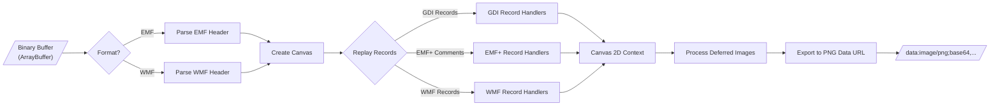
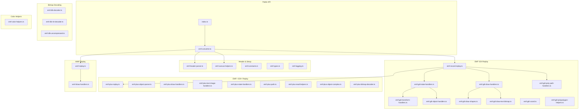
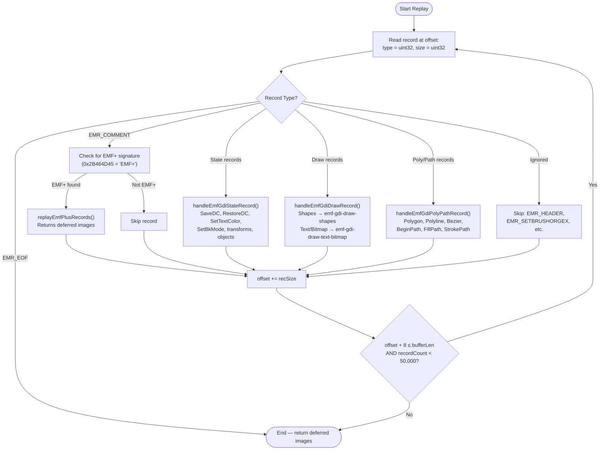
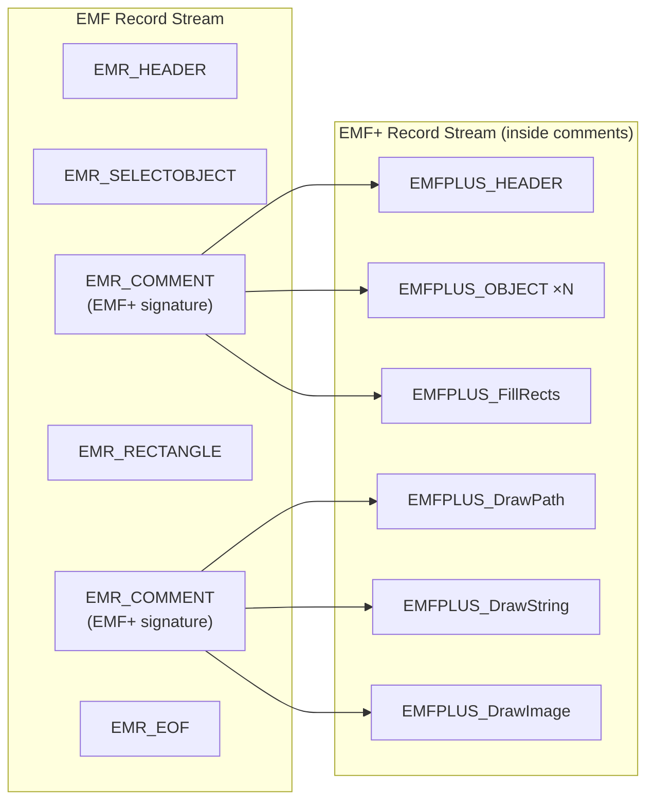
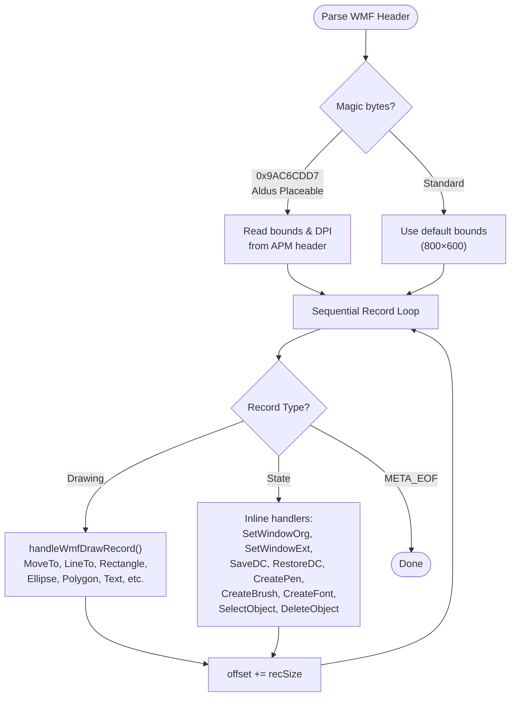
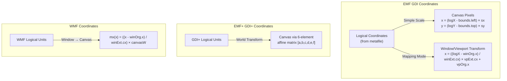
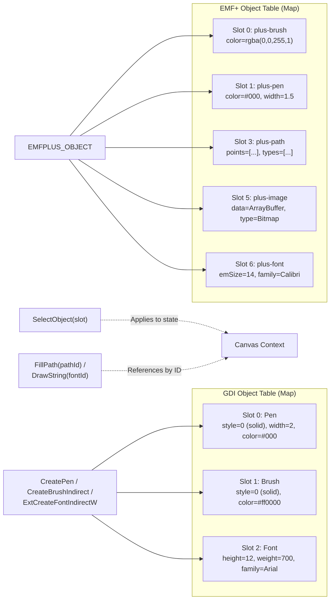
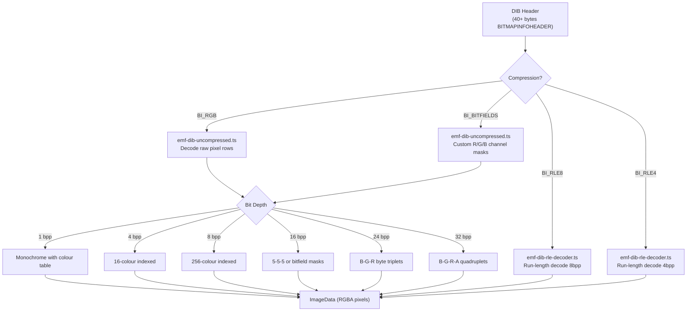
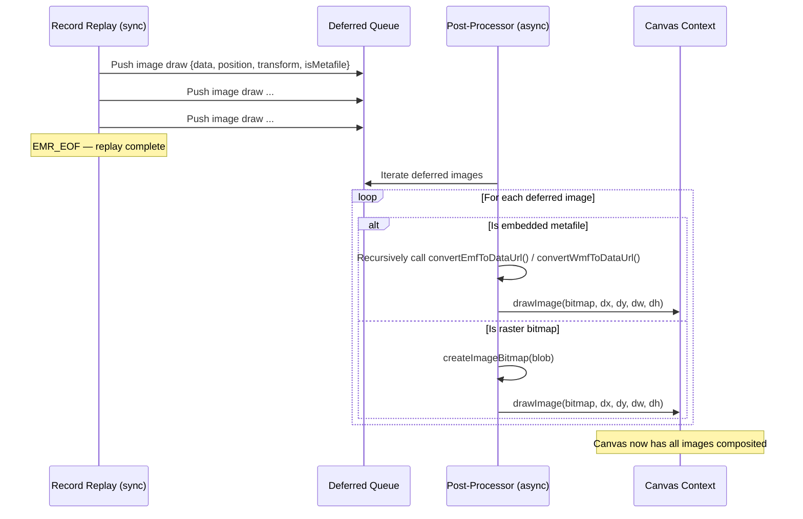

# emf-converter

A zero-dependency TypeScript library that converts **EMF** (Enhanced Metafile) and **WMF** (Windows Metafile) binary buffers into **PNG data URLs** by parsing their record streams and replaying drawing commands onto an HTML Canvas.

## Table of Contents

- [Overview](#overview)
- [Quick Start](#quick-start)
- [API Reference](#api-reference)
- [Architecture](#architecture)
  - [High-Level Pipeline](#high-level-pipeline)
  - [Module Map](#module-map)
  - [EMF Record Replay Loop](#emf-record-replay-loop)
  - [EMF+ Dual-Mode Processing](#emf-dual-mode-processing)
  - [WMF Processing](#wmf-processing)
- [Deep Dive: How It Works](#deep-dive-how-it-works)
  - [1. Header Parsing](#1-header-parsing)
  - [2. Canvas Creation & Scaling](#2-canvas-creation--scaling)
  - [3. GDI Record Replay](#3-gdi-record-replay)
  - [4. EMF+ Record Replay](#4-emf-record-replay)
  - [5. Coordinate Systems](#5-coordinate-systems)
  - [6. GDI Object Table](#6-gdi-object-table)
  - [7. DIB (Bitmap) Decoding](#7-dib-bitmap-decoding)
  - [8. Deferred Image Processing](#8-deferred-image-processing)
  - [9. World Transforms](#9-world-transforms)
- [Supported Record Types](#supported-record-types)
- [File Structure Reference](#file-structure-reference)
- [Limitations](#limitations)

---

## Overview

Windows Metafiles (EMF/WMF) are vector image formats that store a sequence of GDI (Graphics Device Interface) drawing commands. They are commonly embedded inside Office documents (PPTX, DOCX) and legacy Windows applications. This converter reads the raw binary data, interprets each record, and replays the drawing operations onto an HTML5 Canvas to produce a rasterised PNG.

The library handles three distinct formats:

| Format | Description | Record Size | Coordinate System |
|--------|-------------|-------------|-------------------|
| **WMF** | Windows Metafile (16-bit) | 16-bit word-aligned | Window/viewport mapping |
| **EMF** | Enhanced Metafile (32-bit GDI) | 32-bit aligned | Bounds-based scaling |
| **EMF+** | GDI+ extension embedded in EMF | 32-bit aligned | World transform matrix |

---

## Quick Start

```typescript
import { convertEmfToDataUrl, convertWmfToDataUrl } from "emf-converter";

// Convert an EMF buffer to a PNG data URL
const emfBuffer: ArrayBuffer = /* loaded from file or network */;
const pngDataUrl = await convertEmfToDataUrl(emfBuffer);
// => "data:image/png;base64,iVBORw0KGgo..."

// Convert a WMF buffer to a PNG data URL
const wmfBuffer: ArrayBuffer = /* loaded from file or network */;
const wmfPng = await convertWmfToDataUrl(wmfBuffer);

// Optional: limit output dimensions
const scaled = await convertEmfToDataUrl(emfBuffer, 1024, 768);
```

Both functions return `Promise<string | null>` — they return `null` if the buffer is invalid or no canvas API is available.

---

## API Reference

### `convertEmfToDataUrl(buffer, maxWidth?, maxHeight?)`

Converts an EMF binary buffer to a PNG data URL.

| Parameter | Type | Description |
|-----------|------|-------------|
| `buffer` | `ArrayBuffer` | The raw EMF file bytes |
| `maxWidth` | `number` (optional) | Maximum output width in pixels |
| `maxHeight` | `number` (optional) | Maximum output height in pixels |
| **Returns** | `Promise<string \| null>` | PNG data URL or `null` on failure |

### `convertWmfToDataUrl(buffer, maxWidth?, maxHeight?)`

Converts a WMF binary buffer to a PNG data URL.

| Parameter | Type | Description |
|-----------|------|-------------|
| `buffer` | `ArrayBuffer` | The raw WMF file bytes |
| `maxWidth` | `number` (optional) | Maximum output width in pixels |
| `maxHeight` | `number` (optional) | Maximum output height in pixels |
| **Returns** | `Promise<string \| null>` | PNG data URL or `null` on failure |

---

## Architecture

### High-Level Pipeline

The converter follows a three-phase pipeline: **Parse → Replay → Export**.



### Module Map

Every source file has a specific responsibility. Here's how they connect:



### EMF Record Replay Loop

The core of the EMF converter is a sequential record-scanning loop that dispatches each record to the appropriate handler:



### EMF+ Dual-Mode Processing

EMF files can contain embedded EMF+ records inside `EMR_COMMENT` records. When detected, these are processed by a parallel GDI+ replay engine:



The EMF+ state (object table, world transform, save stack) **persists across multiple `EMR_COMMENT` records** within the same file, allowing complex drawings to span several comment blocks.

### WMF Processing

WMF uses a simpler 16-bit record format with word-aligned record sizes:



---

## Deep Dive: How It Works

### 1. Header Parsing

**EMF** files begin with an `EMR_HEADER` record (type `1`) containing:
- **Bounds rectangle** (8–20 bytes): the logical pixel extents of the drawing
- **Frame rectangle** (24–36 bytes): the physical dimensions in 0.01mm units

The parser in `emf-header-parser.ts` tries the bounds first; if they're degenerate (zero width/height), it falls back to the frame rectangle.

**WMF** files may have an optional **Aldus Placeable Metafile (APM)** header (magic `0x9AC6CDD7`) at byte 0, which provides bounds and DPI. The standard WMF header follows, starting with a file type (`1` = in-memory, `2` = on-disk).

### 2. Canvas Creation & Scaling

`emf-canvas-helpers.ts` → `createCanvas()` creates a rendering surface:

1. Compute logical dimensions from the metafile bounds
2. Apply `maxWidth`/`maxHeight` constraints if provided (maintaining aspect ratio)
3. Clamp to a maximum of **4096×4096** pixels to prevent memory issues
4. Prefer `OffscreenCanvas` (works in Web Workers); fall back to `HTMLCanvasElement`

### 3. GDI Record Replay

The GDI replay engine (`emf-record-replay.ts`) scans records sequentially. Each record has an 8-byte header:

```
┌──────────────┬──────────────┐
│  Record Type │  Record Size │
│   (uint32)   │   (uint32)   │
│   4 bytes    │   4 bytes    │
├──────────────┴──────────────┤
│         Record Data         │
│     (recSize - 8 bytes)     │
└─────────────────────────────┘
```

Records are dispatched to three handler modules:

| Module | Handles |
|--------|---------|
| `emf-gdi-state-handlers.ts` | SaveDC, RestoreDC, SetTextColor, SetBkColor, SetBkMode, SetPolyFillMode, SetTextAlign + delegates to transform and object handlers |
| `emf-gdi-draw-handlers.ts` | Delegates to shape handlers (MoveTo, LineTo, Rectangle, Ellipse, Arc family) and text/bitmap handlers (ExtTextOutW, BitBlt, StretchDIBits) |
| `emf-gdi-poly-path-handlers.ts` | Polygon, Polyline, PolyBezier (16-bit and 32-bit variants), PolyPolygon, BeginPath/EndPath/FillPath/StrokePath/CloseFigure |

### 4. EMF+ Record Replay

EMF+ records are embedded inside `EMR_COMMENT` records, identified by the signature `0x2B464D45` ("EMF+" in little-endian). Each EMF+ record has a 12-byte header:

```
┌──────────────┬──────────────┬──────────────┬──────────────┐
│  Record Type │  Record Flags│  Record Size │  Data Size   │
│   (uint16)   │   (uint16)   │   (uint32)   │   (uint32)   │
│   2 bytes    │   2 bytes    │   4 bytes    │   4 bytes    │
├──────────────┴──────────────┴──────────────┴──────────────┤
│                       Record Data                         │
│                   (dataSize bytes)                         │
└───────────────────────────────────────────────────────────┘
```

The EMF+ replay engine (`emf-plus-replay.ts`) dispatches to:

| Module | Handles |
|--------|---------|
| `emf-plus-object-parser.ts` | Object definitions: Brush, Pen, Font, Path, Image, StringFormat, ImageAttributes |
| `emf-plus-draw-handlers.ts` | Shape operations: FillRects, DrawRects, FillEllipse, DrawEllipse, FillPie, DrawPie, DrawArc, DrawLines, FillPolygon |
| `emf-plus-text-image-handlers.ts` | FillPath, DrawPath, DrawString, DrawDriverString, DrawImage, DrawImagePoints |
| `emf-plus-state-handlers.ts` | Transform operations (Set/Reset/Multiply/Translate/Scale/Rotate WorldTransform), Save/Restore, Clipping, Rendering hints |

### 5. Coordinate Systems

The converter manages multiple coordinate mapping systems:



**GDI coordinates** (`emf-gdi-coord.ts`) use either simple bounds-based scaling or full window/viewport mapping mode, activated when the metafile sets `SetWindowExtEx`/`SetViewportExtEx`.

**EMF+ coordinates** use a 6-element affine transformation matrix `[a, b, c, d, e, f]` applied via `ctx.setTransform()`, supporting rotation, scaling, shearing, and translation.

**WMF coordinates** map through closure-based `mx()`/`my()`/`mw()`/`mh()` functions that convert from window space to canvas pixels.

### 6. GDI Object Table

Both GDI and GDI+ maintain their own object tables — essentially registries of reusable drawing resources:



**GDI objects** are created via `EMR_CREATEPEN`, `EMR_CREATEBRUSHINDIRECT`, `EMR_EXTCREATEFONTINDIRECTW`, etc., and selected into the drawing context with `EMR_SELECTOBJECT`. Stock objects (base index `0x80000000`) provide system defaults like `WHITE_BRUSH`, `BLACK_PEN`, etc.

**EMF+ objects** are defined via `EMFPLUS_OBJECT` records with a type/ID pair. Drawing commands reference objects by their slot ID in the lower 8 bits of `recFlags`.

### 7. DIB (Bitmap) Decoding

Metafiles can contain embedded bitmaps as Device-Independent Bitmaps (DIBs). The decoder pipeline handles:



EMF+ also has its own bitmap format (`emf-plus-bitmap-decoder.ts`) supporting GDI+ pixel formats:
- `PixelFormat24bppRGB`
- `PixelFormat32bppRGB`
- `PixelFormat32bppARGB`
- `PixelFormat32bppPARGB` (pre-multiplied alpha, un-multiplied during decode)

### 8. Deferred Image Processing

Image draws (both GDI `StretchDIBits`/`BitBlt` and EMF+ `DrawImage`/`DrawImagePoints`) that reference bitmaps or embedded metafiles are collected as **deferred images** during the synchronous replay phase. After all records are processed, these are resolved asynchronously:



This two-phase approach is necessary because `createImageBitmap()` is asynchronous, while the GDI record replay loop is synchronous for performance.

### 9. World Transforms

EMF+ supports a full 2D affine transformation matrix. The converter maintains and composes transforms using standard matrix multiplication:

```
┌         ┐   ┌             ┐   ┌    ┐
│ x_out   │   │  a   b   0  │   │ x  │
│ y_out   │ = │  c   d   0  │ × │ y  │
│ 1       │   │  e   f   1  │   │ 1  │
└         ┘   └             ┘   └    ┘
```

Stored as a 6-element tuple: `[a, b, c, d, e, f]`

Supported transform operations:
| Operation | Effect |
|-----------|--------|
| `SetWorldTransform` | Replace the current matrix |
| `ResetWorldTransform` | Reset to identity `[1,0,0,1,0,0]` |
| `MultiplyWorldTransform` | Pre- or post-multiply with another matrix |
| `TranslateWorldTransform` | Apply translation `(dx, dy)` |
| `ScaleWorldTransform` | Apply scaling `(sx, sy)` |
| `RotateWorldTransform` | Apply rotation by angle (degrees) |

Save/Restore operations push/pop the world transform onto a stack, allowing nested coordinate spaces.

---

## Supported Record Types

### EMF GDI Records

| Category | Records |
|----------|---------|
| **Header/Control** | `EMR_HEADER`, `EMR_EOF`, `EMR_COMMENT` |
| **State** | `EMR_SAVEDC`, `EMR_RESTOREDC`, `EMR_SETTEXTCOLOR`, `EMR_SETBKCOLOR`, `EMR_SETBKMODE`, `EMR_SETPOLYFILLMODE`, `EMR_SETTEXTALIGN`, `EMR_SETROP2`, `EMR_SETSTRETCHBLTMODE`, `EMR_SETMITERLIMIT` |
| **Transforms** | `EMR_SETWINDOWEXTEX`, `EMR_SETWINDOWORGEX`, `EMR_SETVIEWPORTEXTEX`, `EMR_SETVIEWPORTORGEX`, `EMR_SETMAPMODE`, `EMR_SCALEVIEWPORTEXTEX`, `EMR_SCALEWINDOWEXTEX`, `EMR_SETWORLDTRANSFORM`, `EMR_MODIFYWORLDTRANSFORM` |
| **Objects** | `EMR_CREATEPEN`, `EMR_EXTCREATEPEN`, `EMR_CREATEBRUSHINDIRECT`, `EMR_EXTCREATEFONTINDIRECTW`, `EMR_SELECTOBJECT`, `EMR_DELETEOBJECT` |
| **Shapes** | `EMR_MOVETOEX`, `EMR_LINETO`, `EMR_RECTANGLE`, `EMR_ROUNDRECT`, `EMR_ELLIPSE`, `EMR_ARC`, `EMR_ARCTO`, `EMR_CHORD`, `EMR_PIE` |
| **Poly/Path** | `EMR_POLYGON`, `EMR_POLYLINE`, `EMR_POLYBEZIER`, `EMR_POLYBEZIERTO`, `EMR_POLYLINETO`, `EMR_POLYGON16`, `EMR_POLYLINE16`, `EMR_POLYBEZIER16`, `EMR_POLYBEZIERTO16`, `EMR_POLYLINETO16`, `EMR_POLYPOLYGON`, `EMR_POLYPOLYGON16` |
| **Path Ops** | `EMR_BEGINPATH`, `EMR_ENDPATH`, `EMR_CLOSEFIGURE`, `EMR_FILLPATH`, `EMR_STROKEANDFILLPATH`, `EMR_STROKEPATH`, `EMR_SELECTCLIPPATH` |
| **Text** | `EMR_EXTTEXTOUTW` |
| **Bitmap** | `EMR_BITBLT`, `EMR_STRETCHDIBITS` |
| **Clipping** | `EMR_INTERSECTCLIPRECT` |

### EMF+ Records

| Category | Records |
|----------|---------|
| **Control** | `Header`, `EndOfFile`, `GetDC` |
| **Objects** | `Object` (Brush, Pen, Path, Font, Image, StringFormat, ImageAttributes) |
| **Shapes** | `FillRects`, `DrawRects`, `FillEllipse`, `DrawEllipse`, `FillPie`, `DrawPie`, `DrawArc`, `DrawLines`, `FillPolygon` |
| **Path** | `FillPath`, `DrawPath` |
| **Text** | `DrawString`, `DrawDriverString` |
| **Images** | `DrawImage`, `DrawImagePoints` |
| **Transforms** | `SetWorldTransform`, `ResetWorldTransform`, `MultiplyWorldTransform`, `TranslateWorldTransform`, `ScaleWorldTransform`, `RotateWorldTransform`, `SetPageTransform` |
| **State** | `Save`, `Restore`, `BeginContainerNoParams`, `EndContainer` |
| **Clipping** | `ResetClip`, `SetClipRect`, `SetClipPath`, `SetClipRegion` |
| **Hints** | `SetAntiAliasMode`, `SetTextRenderingHint`, `SetInterpolationMode`, `SetPixelOffsetMode`, `SetCompositingQuality` |

### WMF Records

| Category | Records |
|----------|---------|
| **Control** | `META_EOF` |
| **State** | `META_SAVEDC`, `META_RESTOREDC`, `META_SETWINDOWORG`, `META_SETWINDOWEXT`, `META_SETTEXTCOLOR`, `META_SETBKCOLOR`, `META_SETBKMODE`, `META_SETPOLYFILLMODE`, `META_SETTEXTALIGN`, `META_SETROP2` |
| **Objects** | `META_CREATEPENINDIRECT`, `META_CREATEBRUSHINDIRECT`, `META_CREATEFONTINDIRECT`, `META_SELECTOBJECT`, `META_DELETEOBJECT` |
| **Shapes** | `META_MOVETO`, `META_LINETO`, `META_RECTANGLE`, `META_ROUNDRECT`, `META_ELLIPSE`, `META_ARC`, `META_PIE`, `META_CHORD` |
| **Poly** | `META_POLYGON`, `META_POLYLINE`, `META_POLYPOLYGON` |
| **Text** | `META_TEXTOUT`, `META_EXTTEXTOUT` |

---

## File Structure Reference

```
src/
├── index.ts                        # Barrel re-export of public API
├── emf-converter.ts                # Public API: convertEmfToDataUrl, convertWmfToDataUrl
├── emf-types.ts                    # All TypeScript type definitions & state factories
├── emf-constants.ts                # Numeric constants for EMF/EMF+/WMF record types
├── emf-logging.ts                  # Debug logging (toggle via DEBUG_EMF flag)
├── emf-color-helpers.ts            # COLORREF → hex, ARGB → rgba() conversions
├── emf-canvas-helpers.ts           # Canvas creation, styling, stock objects, UTF-16 reading
├── emf-header-parser.ts            # EMF & WMF binary header parsers
│
├── emf-record-replay.ts            # Main EMF GDI record loop & dispatcher
├── emf-gdi-state-handlers.ts       # GDI state: save/restore, color/mode settings
├── emf-gdi-transform-handlers.ts   # GDI coordinate system & world transform records
├── emf-gdi-object-handlers.ts      # GDI object creation, selection, deletion
├── emf-gdi-draw-handlers.ts        # GDI draw dispatcher (shapes + text/bitmap)
├── emf-gdi-draw-shapes.ts          # GDI shape drawing: lines, rects, ellipses, arcs
├── emf-gdi-draw-text-bitmap.ts     # GDI text output & bitmap block transfers
├── emf-gdi-coord.ts                # GDI coordinate mapping (gmx/gmy/gmw/gmh)
├── emf-gdi-poly-path-handlers.ts   # GDI polygon, polyline, bezier, path operations
├── emf-gdi-polypolygon-helpers.ts   # PolyPolygon specialised helpers
│
├── emf-plus-replay.ts              # EMF+ record loop & dispatcher
├── emf-plus-object-parser.ts       # EMF+ OBJECT record → type-specific parsers
├── emf-plus-object-complex.ts      # Complex object parsers: Pen, Image, Font
├── emf-plus-draw-handlers.ts       # EMF+ shape fill/draw handlers
├── emf-plus-text-image-handlers.ts # EMF+ text, image, and path-based drawing
├── emf-plus-state-handlers.ts      # EMF+ transforms, save/restore, clipping
├── emf-plus-path.ts                # EMF+ path parsing & canvas replay
├── emf-plus-read-helpers.ts        # EMF+ compressed/float rect & point readers
├── emf-plus-bitmap-decoder.ts      # EMF+ GDI+ pixel format → BMP decoder
│
├── emf-dib-decoder.ts              # DIB header parsing & format dispatcher
├── emf-dib-rle-decoder.ts          # RLE4/RLE8 bitmap decompression
├── emf-dib-uncompressed.ts         # Uncompressed & bitfield DIB row decoder
│
├── wmf-replay.ts                   # WMF record loop & dispatcher
├── wmf-draw-handlers.ts            # WMF drawing record handlers
│
└── index.test.ts                   # Test suite
```

---

## Limitations

- **No EMF+ region objects** — `EMFPLUS_OBJECTTYPE_REGION` is not parsed
- **Gradient brushes are simplified** — `LinearGradient` and `PathGradient` brush types extract only the primary colour rather than rendering full gradient fills
- **No raster operations (ROP)** — `SetROP2` is acknowledged but raster operation blending modes are not applied
- **Limited clipping** — `IntersectClipRect` and `SelectClipPath` are supported; complex region clipping is not
- **Maximum canvas size** — Output is clamped to 4096×4096 pixels
- **Maximum record count** — Processing stops after 50,000 records (EMF/WMF) or 100,000 records (EMF+) as a safety limit
- **Font rendering** — Text is rendered using the browser's font engine, so results may differ from the original Windows GDI rendering
- **No EMF spool records** — Print spooler–specific record types are not handled
- **Canvas API required** — The library needs either `OffscreenCanvas` or `HTMLCanvasElement` to be available in the runtime environment
