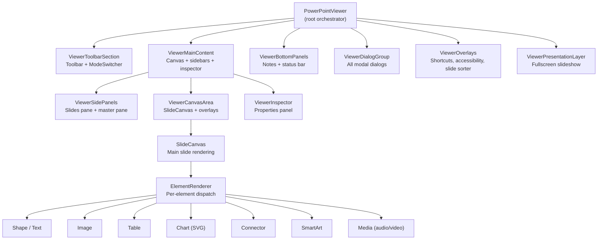
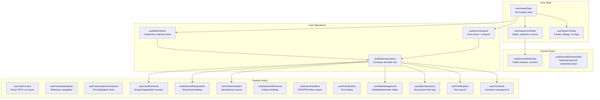
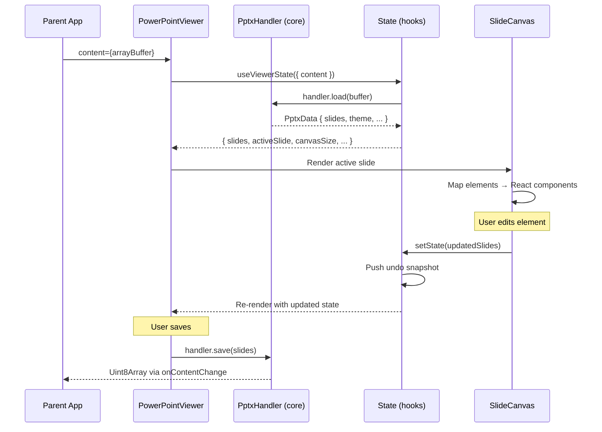
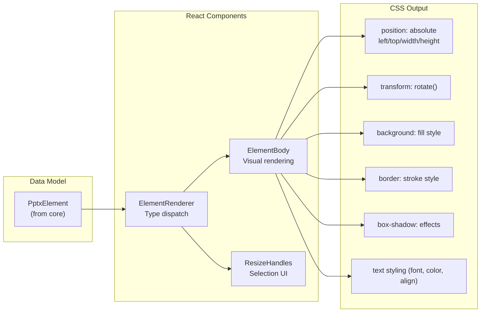
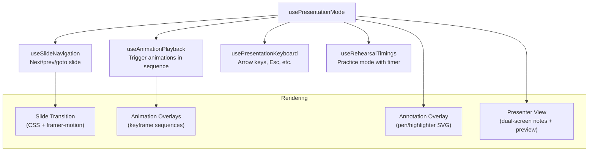
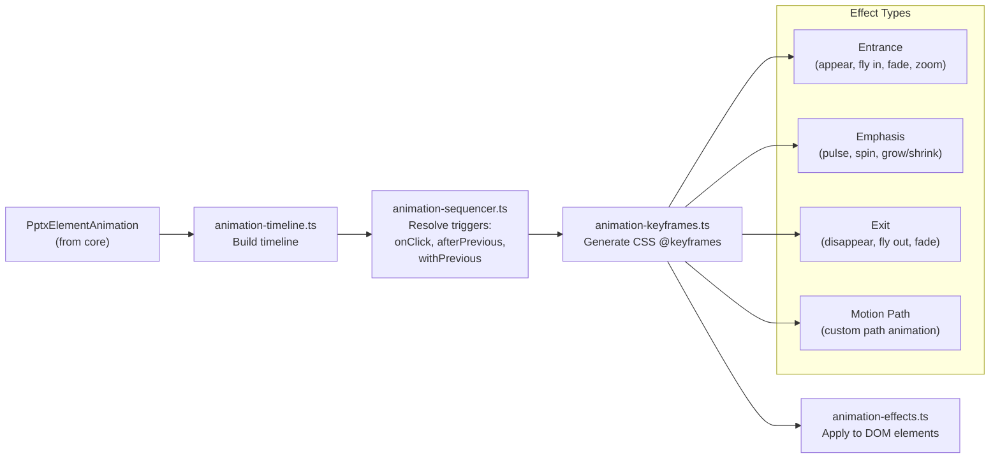
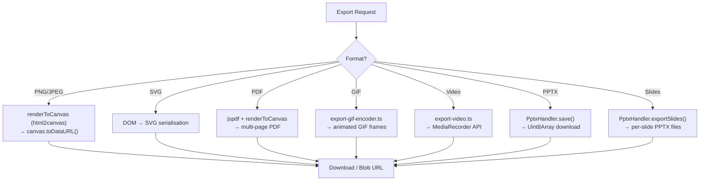
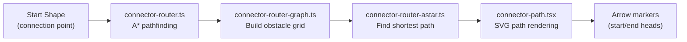

# pptx-viewer

A full-featured **React** component for viewing, editing, and presenting PowerPoint (.pptx) files in the browser. Built on top of `pptx-viewer-core`, it provides a complete UI with toolbar, inspector panels, slide canvas, animation engine, presentation mode, and export capabilities.

## Table of Contents

- [pptx-viewer](#pptx-viewer)
  - [Table of Contents](#table-of-contents)
  - [Overview](#overview)
  - [Quick Start](#quick-start)
  - [API Reference](#api-reference)
    - [`PowerPointViewer` Component](#powerpointviewer-component)
    - [`PowerPointViewerHandle` (imperative API)](#powerpointviewerhandle-imperative-api)
    - [`renderToCanvas`](#rendertocanvas)
  - [Styling & Theming](#styling--theming)
    - [Mode 1: Tailwind CSS project](#mode-1-tailwind-css-project-no-extra-setup)
    - [Mode 2: Bundled stylesheet](#mode-2-no-tailwind--use-the-bundled-stylesheet)
    - [Mode 3: CSS custom properties](#mode-3-css-custom-properties-only)
    - [`ViewerTheme` reference](#viewertheme-reference)
    - [Theme utilities](#theme-utilities)
    - [Light theme example](#light-theme-example)
  - [Architecture](#architecture)
    - [High-Level Component Tree](#high-level-component-tree)
    - [Hook Composition](#hook-composition)
    - [Data Flow](#data-flow)
    - [Rendering Pipeline](#rendering-pipeline)
  - [Deep Dive: How It Works](#deep-dive-how-it-works)
    - [1. Component Hierarchy](#1-component-hierarchy)
    - [2. State Management](#2-state-management)
    - [3. Slide Canvas Rendering](#3-slide-canvas-rendering)
    - [4. Element Rendering](#4-element-rendering)
    - [5. Inspector Panels](#5-inspector-panels)
    - [6. Presentation Mode](#6-presentation-mode)
    - [7. Animation Engine](#7-animation-engine)
    - [8. Chart Rendering](#8-chart-rendering)
    - [9. Export System](#9-export-system)
    - [10. Connector Routing](#10-connector-routing)
  - [Hooks Reference](#hooks-reference)
  - [Utility Modules Reference](#utility-modules-reference)
  - [File Structure Reference](#file-structure-reference)
  - [Limitations](#limitations)

---

## Overview

This package provides a drop-in React component that turns raw `.pptx` bytes into a fully interactive PowerPoint experience. The viewer renders slides using **CSS-based layout** (not Canvas) for sharp text, accessibility, and DOM interactivity.

| Feature | Description |
|---------|-------------|
| **View** | Render slides with shapes, text, images, tables, charts, SmartArt, connectors, media |
| **Edit** | Insert/move/resize/delete elements, edit text inline, modify styles, manage slides |
| **Present** | Fullscreen slideshow with animations, transitions, speaker notes, presenter view |
| **Export** | PNG/JPEG/SVG/PDF/GIF/video slide export, save-as PPTX |
| **Print** | Print dialog with handout layouts and notes page formatting |
| **Annotate** | Pen/highlighter/laser pointer tools during presentations |
| **Compare** | Side-by-side slide diff comparison |
| **Find & Replace** | Cross-slide text search with regex support |
| **Accessibility** | Keyboard navigation, alt-text audit panel, screen reader support |

**Peer dependencies:** React 19, framer-motion, html2canvas, lucide-react, react-icons, jspdf, jszip, fast-xml-parser, i18next/react-i18next.

---

## Quick Start

```tsx
import { PowerPointViewer } from "pptx-viewer";
import type { PowerPointViewerHandle } from "pptx-viewer";
import { useRef, useEffect, useState } from "react";

// If your project does NOT use Tailwind CSS, import the bundled stylesheet:
import "pptx-viewer/styles";

function App() {
  const viewerRef = useRef<PowerPointViewerHandle>(null);
  const [content, setContent] = useState<ArrayBuffer | null>(null);

  useEffect(() => {
    fetch("presentation.pptx")
      .then(r => r.arrayBuffer())
      .then(setContent);
  }, []);

  const handleSave = async () => {
    if (viewerRef.current) {
      const bytes = await viewerRef.current.getContent();
      // Save bytes to file...
    }
  };

  if (!content) return <div>Loading...</div>;

  return (
    <div style={{ height: "100vh" }}>
      <PowerPointViewer
        ref={viewerRef}
        content={content}
        canEdit={true}
        onContentChange={(dirty) => console.log("Dirty:", dirty)}
        onDirtyChange={(isDirty) => console.log("Is dirty:", isDirty)}
        onActiveSlideChange={(index) => console.log("Slide:", index)}
      />
    </div>
  );
}
```

The component fills its parent container. Make sure the parent has a defined height.

---

## API Reference

### `PowerPointViewer` Component

The main React component. Uses `forwardRef` to expose an imperative handle.

**Props (`PowerPointViewerProps`):**

| Prop | Type | Default | Description |
|------|------|---------|-------------|
| `content` | `ArrayBuffer \| Uint8Array \| null` | required | Raw .pptx file bytes |
| `filePath` | `string` | — | Optional file path (for display and autosave) |
| `canEdit` | `boolean` | `false` | Enable editing mode |
| `onContentChange` | `(dirty: boolean) => void` | — | Called when content changes |
| `onDirtyChange` | `(isDirty: boolean) => void` | — | Called when dirty state changes |
| `onActiveSlideChange` | `(index: number) => void` | — | Called when active slide changes |
| `theme` | `ViewerTheme` | — | Theme configuration for customising colours, radius, and CSS vars |

### `PowerPointViewerHandle` (imperative API)

Exposed via `ref`. Extends `FileViewerHandle`.

| Method | Signature | Description |
|--------|-----------|-------------|
| `getContent` | `() => Promise<string \| Uint8Array>` | Serialise current state to .pptx bytes |

### `renderToCanvas`

Standalone utility for rendering a DOM element to a Canvas with oklch colour space workaround.

```typescript
import { renderToCanvas } from "pptx-viewer";

const canvas = await renderToCanvas(element, options);
// => HTMLCanvasElement with the rendered content
```

---

## Styling & Theming

The viewer's UI is built with utility CSS classes that reference **CSS custom properties** for all visual tokens (colours, border-radius, etc.). This means it works in three modes:

### Mode 1: Tailwind CSS project (no extra setup)

If your project already uses **Tailwind CSS v4** with semantic colour tokens (the shadcn/ui convention), the viewer classes will resolve through your existing Tailwind configuration. No additional CSS import is needed.

If you want to override specific values, pass a `theme` prop:

```tsx
<PowerPointViewer
  content={bytes}
  theme={{
    colors: { primary: "#6366f1", background: "#0f172a" },
  }}
/>
```

### Mode 2: No Tailwind — use the bundled stylesheet

Import the self-contained CSS file that ships with the package. It includes all the utility classes the viewer needs plus sensible dark-theme defaults:

```tsx
// Import once at your app's entry point
import "pptx-viewer/styles";
// or: import "pptx-viewer/styles.css";
```

Then optionally customise with the `theme` prop or by setting CSS custom properties in your own stylesheet.

### Mode 3: CSS custom properties only

If you want full control, define the `--pptx-*` custom properties yourself and skip both the bundled CSS and the `theme` prop:

```css
:root {
  --pptx-background: #0f172a;
  --pptx-foreground: #f8fafc;
  --pptx-primary: #6366f1;
  --pptx-primary-foreground: #ffffff;
  --pptx-muted: #1e293b;
  --pptx-muted-foreground: #94a3b8;
  --pptx-accent: #1e293b;
  --pptx-accent-foreground: #f8fafc;
  --pptx-card: #1e293b;
  --pptx-card-foreground: #f8fafc;
  --pptx-popover: #1e293b;
  --pptx-popover-foreground: #f8fafc;
  --pptx-border: #334155;
  --pptx-destructive: #ef4444;
  --pptx-destructive-foreground: #ffffff;
  --pptx-input: #334155;
  --pptx-ring: #6366f1;
  --pptx-radius: 0.5rem;
}
```

### `ViewerTheme` reference

```typescript
import type { ViewerTheme } from "pptx-viewer";

const myTheme: ViewerTheme = {
  colors: {
    // All properties are optional — only override what you need.
    background: "#0f172a",       // Page / root background
    foreground: "#f8fafc",       // Default text colour
    card: "#1e293b",             // Card / panel surface
    cardForeground: "#f8fafc",   // Text on card surfaces
    popover: "#1e293b",          // Popover / dropdown surface
    popoverForeground: "#f8fafc",// Text inside popovers
    primary: "#6366f1",          // Primary action colour
    primaryForeground: "#ffffff",// Text on primary backgrounds
    secondary: "#334155",        // Secondary action colour
    secondaryForeground: "#f8fafc",
    muted: "#1e293b",            // Muted / disabled surface
    mutedForeground: "#94a3b8",  // Secondary text colour
    accent: "#1e293b",           // Hover-highlight surface
    accentForeground: "#f8fafc", // Text on accent surfaces
    destructive: "#ef4444",      // Danger / delete colour
    destructiveForeground: "#ffffff",
    border: "#334155",           // Default border colour
    input: "#334155",            // Input field border
    ring: "#6366f1",             // Focus ring colour
  },
  radius: "0.5rem",             // Base border-radius

  // Escape hatch for arbitrary CSS custom properties
  cssVars: {
    "--my-custom-shadow": "0 4px 12px rgba(0,0,0,0.5)",
  },
};
```

### Theme utilities

```typescript
import {
  defaultThemeColors,  // Full set of default colour values
  defaultRadius,       // Default border-radius ("0.5rem")
  themeToCssVars,      // Convert a ViewerTheme → Record<string, string> of CSS vars
  defaultCssVars,      // Get all default --pptx-* CSS vars
  ViewerThemeProvider, // React context provider (advanced)
  useViewerTheme,      // Hook to read current theme from context
} from "pptx-viewer";
```

### Light theme example

```tsx
<PowerPointViewer
  content={bytes}
  theme={{
    colors: {
      background: "#ffffff",
      foreground: "#0f172a",
      card: "#f8fafc",
      cardForeground: "#0f172a",
      popover: "#ffffff",
      popoverForeground: "#0f172a",
      primary: "#4f46e5",
      primaryForeground: "#ffffff",
      muted: "#f1f5f9",
      mutedForeground: "#64748b",
      accent: "#f1f5f9",
      accentForeground: "#0f172a",
      border: "#e2e8f0",
      destructive: "#dc2626",
      destructiveForeground: "#ffffff",
    },
  }}
/>
```

---

## Architecture

### High-Level Component Tree



### Hook Composition

The viewer's logic is decomposed into ~30 custom hooks, composed in `PowerPointViewer.tsx`:



### Data Flow



### Rendering Pipeline

Slides are rendered using **CSS positioning and transforms**, not HTML Canvas. This enables:
- Crisp text rendering at any zoom level
- Native browser text selection and accessibility
- DOM-based interaction (click, drag, resize)
- Standard CSS effects (shadows, gradients, borders)



---

## Deep Dive: How It Works

### 1. Component Hierarchy

The component tree is split into six main sections, each rendered conditionally based on the current `ViewerMode`:

| Component | Visible In | Purpose |
|-----------|-----------|---------|
| `ViewerToolbarSection` | edit, preview, master | Toolbar with formatting, insert, view controls |
| `ViewerMainContent` | all modes | Central area: slides pane + canvas + inspector |
| `ViewerBottomPanels` | edit, preview, master | Speaker notes editor + status bar |
| `ViewerDialogGroup` | any (modal) | All dialogs: properties, export, print, signatures, etc. |
| `ViewerOverlays` | any (overlay) | Keyboard shortcuts, accessibility audit, slide sorter |
| `ViewerPresentationLayer` | present | Fullscreen slideshow with transition/animation engine |

**Component counts by directory:**

| Directory | Files | Purpose |
|-----------|-------|---------|
| `components/` (root) | ~80 | Core UI components |
| `components/inspector/` | 84 | Property inspector panels |
| `components/toolbar/` | 17 | Toolbar sections and controls |
| `components/canvas/` | 14 | Canvas overlays, rulers, grids |
| `components/elements/` | 10 | Element-specific renderers |
| `components/slides-pane/` | 7 | Slide thumbnail sidebar |
| `components/slide-sorter/` | 7 | Drag-and-drop slide reordering |
| `components/notes/` | 6 | Notes editing toolbar and utils |
| `components/print/` | 5 | Print preview and layout |

### 2. State Management

All state lives in React hooks — no external state library. The state is split across two layers:

**`useViewerCoreState`** — Document-level state:
- `slides` — The slide array (source of truth)
- `activeSlideIndex` — Currently selected slide
- `selectedElementId` / `selectedElementIds` — Selection
- `canvasSize` — Slide dimensions (width × height in px)
- `mode` — Current viewer mode (`edit` | `preview` | `present` | `master`)
- `templateElementsBySlideId` — Layout/master elements per slide
- Refs for drag/resize/marquee interaction state

**`useViewerUIState`** — UI-level state:
- Panel visibility (slides pane, notes, inspector, accessibility)
- Dialog open/close flags
- Toolbar state (draw mode, format painter, eyedropper)
- Find/replace state
- Custom shows, sections, guides

**`useEditorHistory`** — Undo/redo:
- Maintains a snapshot stack of `{ slides, canvasSize, activeSlideIndex, ... }`
- Defers snapshots during pointer interactions (drag, resize)
- Triggered by a `pointerCommitNonce` that increments when an interaction ends

### 3. Slide Canvas Rendering

`SlideCanvas` renders the active slide as a scaled, positioned `div`:

```
┌─────────────────────────────────────────────┐
│ Canvas Container (scrollable viewport)       │
│   ┌───────────────────────────────────┐      │
│   │ Slide Div (scaled via transform)  │      │
│   │   ┌─────────────────────────────┐ │      │
│   │   │ Background (gradient/image) │ │      │
│   │   ├─────────────────────────────┤ │      │
│   │   │ Template elements (layout)  │ │      │
│   │   ├─────────────────────────────┤ │      │
│   │   │ Slide elements              │ │      │
│   │   │   ElementRenderer ×N        │ │      │
│   │   ├─────────────────────────────┤ │      │
│   │   │ Canvas Overlays:            │ │      │
│   │   │  - Grid                     │ │      │
│   │   │  - Rulers                   │ │      │
│   │   │  - Drawing overlay (SVG)    │ │      │
│   │   │  - Connector overlay        │ │      │
│   │   │  - Comment markers          │ │      │
│   │   │  - Selection marquee        │ │      │
│   │   └─────────────────────────────┘ │      │
│   └───────────────────────────────────┘      │
└─────────────────────────────────────────────┘
```

**Zoom** is applied via CSS `transform: scale(zoom)` on the slide div, keeping the DOM structure intact for interaction hit-testing.

### 4. Element Rendering

`ElementRenderer` dispatches to specialised renderers based on element type:

| Element Type | Renderer | Technique |
|-------------|----------|-----------|
| `shape` | `ElementBody` + text layout | CSS positioning + HTML text spans |
| `image` | `ImageRenderer` | `` with CSS clip-path, effects, and fills |
| `table` | `table-render.tsx` | HTML `<table>` with cell styling |
| `chart` | `chart.tsx` → SVG | Custom SVG rendering (bar, line, pie, scatter, etc.) |
| `connector` | `ConnectorElementRenderer` | SVG `<path>` with marker arrows |
| `smartArt` | `SmartArtRenderer` | Decomposed shapes with layout-specific positioning |
| `group` | Recursive `ElementRenderer` | Nested div with group transform |
| `media` | `media.tsx` | `<video>` / `<audio>` with custom controls |
| `ink` | `InkGroupRenderers` | SVG `<polyline>` strokes |
| `ole` | `ElementBody` (fallback) | Placeholder with OLE type label |

**Shape visual rendering** (`shape-visual.tsx`, `shape-visual-style.ts`, `shape-visual-effects.ts`):
- Gradient fills → CSS `linear-gradient` / `radial-gradient`
- Pattern fills → repeating CSS background patterns
- Image fills → `background-image` with stretch/tile modes
- Shadows → CSS `box-shadow` or `filter: drop-shadow()`
- 3D effects → CSS `perspective` + `transform3d` approximations
- Text warp → SVG `<textPath>` for curved text effects

### 5. Inspector Panels

The right-side inspector (`InspectorPane`) displays contextual property editors:

| Panel | Shown When | Controls |
|-------|-----------|----------|
| `SlideProperties` | No element selected | Background, layout, size |
| `ElementProperties` | Element selected | Position, size, rotation |
| `FillStrokeProperties` | Shape/connector selected | Fill type, colour, gradient, stroke |
| `TextProperties` | Text element selected | Font, size, colour, alignment, spacing |
| `ImagePropertiesPanel` | Image selected | Crop, effects, artistic filters |
| `TablePropertiesPanel` | Table selected | Cell formatting, borders, band styling |
| `ChartDataPanel` | Chart selected | Series data grid, chart type selector |
| `SmartArtPropertiesPanel` | SmartArt selected | Node editing, layout switching |
| `MediaPropertiesPanel` | Media selected | Playback settings, trim, bookmarks |
| `AnimationPanel` | Any element | Animation timeline, presets, drag-and-drop reorder |
| `SlideTransitionSection` | Slide level | Transition type, duration, advance mode |
| `ConnectorArrowsSection` | Connector selected | Arrow head/tail type and size |
| `ThemeEditorPanel` | Theme editing | Colour scheme, font scheme, presets |

### 6. Presentation Mode

Activated by setting `mode` to `"present"`. The `ViewerPresentationLayer` takes over with:



**Slide transitions** (`slide-transitions.ts`, `transition-keyframes.ts`):
- 50+ transition types matching PowerPoint's built-in transitions
- CSS `@keyframes` for fade, push, wipe, split, reveal, etc.
- p14 extension transitions (vortex, ripple, shred, etc.)
- Morph transitions computed from element ID matching

### 7. Animation Engine

The animation system (`viewer/utils/animation*.ts`, ~14 files) processes OOXML timing trees:



Supports 80+ animation presets with configurable duration, delay, repeat, and text-build options (by word, by letter, by paragraph).

### 8. Chart Rendering

Charts are rendered as custom SVG using React components (`viewer/utils/chart*.tsx`, ~20 files):

| Chart Type | File |
|-----------|------|
| Bar / Column | `chart-bar.tsx` |
| Stacked Bar | `chart-stacked-bar.tsx` |
| Line / Area | `chart-area-line.tsx` |
| Pie / Doughnut | `chart-pie.tsx` |
| Scatter / Bubble | `chart-scatter-bubble.tsx` |
| Radar | `chart-radar.tsx` |
| Stock (OHLC) | `chart-stock.tsx` |
| Waterfall / Combo | `chart-waterfall-combo.tsx` |
| Surface / Treemap | `chart-surface-treemap.tsx` |
| Sunburst / Funnel | `chart-sunburst-funnel.tsx` |
| Trendlines | `chart-trendlines.tsx` |

Chart chrome (axes, legends, titles, gridlines, data labels, data tables) is rendered by `chart-chrome.tsx` and `chart-data-table.tsx`.

### 9. Export System

The export pipeline (`viewer/utils/export*.ts`, `viewer/hooks/useExportHandlers.ts`):



The `renderToCanvas` wrapper (`lib/canvas-export.ts`) patches `html2canvas` to work around oklch colour space parsing issues in browsers that don't fully support it.

### 10. Connector Routing

Connectors between shapes use a graph-based routing algorithm:



The router avoids overlapping shapes by building an obstacle grid and using A* pathfinding with Manhattan distance heuristics. Supports straight, elbow (bent), and curved connector types.

---

## Hooks Reference

| Hook | Purpose |
|------|---------|
| `useViewerState` | All mutable viewer state (composes core + UI state) |
| `useViewerCoreState` | Document state: slides, selection, canvas size, mode |
| `useViewerUIState` | UI state: panel visibility, toolbar flags |
| `useEditorHistory` | Undo/redo snapshot stack with deferred capture |
| `useZoomViewport` | Zoom level, fit-to-width, viewport DOM ref |
| `useDerivedSlideState` | Computed: visible indexes, section groups, master pseudo-slide |
| `useDerivedElementState` | Computed: selected element properties |
| `useLoadContent` | Parse PPTX buffer on mount via PptxHandler |
| `useContentLifecycle` | Content sync, dirty tracking, recovery detection |
| `usePresentationMode` | Slideshow navigation, animation, transitions |
| `usePresentationSetup` | Compose presentation mode + annotations |
| `usePresentationAnnotations` | Pen/highlighter/laser/eraser tools |
| `useEditorOperations` | Compose all editor operations into one result |
| `useViewerIntegration` | Compose I/O, export, print, pointers, lifecycle |
| `useViewerDialogs` | Dialog open/close state management |
| `useElementManipulation` | Move, resize, rotate, delete elements |
| `useElementOperations` | Element property updates |
| `useInsertElements` | Shape, image, text box, table, chart insertion |
| `useSlideManagement` | Add, delete, duplicate, reorder, hide slides |
| `useSectionOperations` | Section add/rename/delete/reorder |
| `useTableOperations` | Insert/delete rows & columns, merge/split cells |
| `usePointerHandlers` | Mouse/touch event processing for canvas |
| `useCanvasInteractions` | Canvas-level interactions (pan, zoom, marquee) |
| `useKeyboardShortcuts` | Hotkey definitions |
| `useKeyboardShortcutWiring` | Bind shortcuts to handler functions |
| `useClipboardHandlers` | Cut/copy/paste via Clipboard API |
| `useGroupAlignLayerHandlers` | Group/ungroup, align, distribute, z-order |
| `useFindReplace` | Text search across all slides |
| `useComments` | Comment CRUD and threading |
| `useExportHandlers` | PNG/PDF/PPTX/GIF/video export |
| `usePrintHandlers` | Print dialog and layout |
| `useThemeHandlers` | Theme application and editing |
| `usePropertyHandlers` | Document property updates |
| `useIOHandlers` | File open/save operations |
| `useSerialize` | Serialise current state to .pptx bytes |
| `useAutosave` | Periodic auto-save with dirty tracking |
| `useFontInjection` | Inject embedded fonts into DOM |
| `useRecoveryDetection` | Detect unsaved changes on reload |
| `useDialogCustomShows` | Custom slideshow management dialog |

---

## Utility Modules Reference

| Category | Files | Key Modules |
|----------|-------|-------------|
| **Shape rendering** | 12 | `shape.tsx`, `shape-visual.tsx`, `shape-visual-style.ts`, `shape-visual-effects.ts`, `shape-visual-3d.ts`, `shape-round-rect.ts`, `shape-adjustment.ts`, `vector-shape-renderer.tsx` |
| **Text rendering** | 10 | `text.tsx`, `text-layout.tsx`, `text-render.tsx`, `text-effects.tsx`, `text-warp.tsx`, `text-warp-css.tsx`, `warp-text-renderer.tsx`, `text-field-substitution.tsx` |
| **Table rendering** | 14 | `table.tsx`, `table-render.tsx`, `table-parse.tsx`, `table-cell-style.tsx`, `table-cell-fill.tsx`, `table-band-style.tsx`, `table-diagonal-borders.tsx`, `table-merge-core.ts` |
| **Chart rendering** | 20 | `chart.tsx`, `chart-bar.tsx`, `chart-pie.tsx`, `chart-area-line.tsx`, `chart-scatter-bubble.tsx`, `chart-radar.tsx`, `chart-stock.tsx`, `chart-chrome.tsx`, `chart-helpers.ts` |
| **SmartArt** | 12 | `smartart.tsx`, `smartart-list.tsx`, `smartart-process.tsx`, `smartart-cycle.tsx`, `smartart-hierarchy.tsx`, `smartart-matrix.tsx`, `smartart-gear.tsx` |
| **Animation** | 14 | `animation.ts`, `animation-timeline.ts`, `animation-sequencer.ts`, `animation-keyframes.ts`, `animation-effects.ts`, `animation-presets.ts`, `animation-sound.ts` |
| **Transitions** | 7 | `slide-transitions.ts`, `transition-keyframes.ts`, `transition-helpers.ts`, `morph-transition.ts`, `p14-transition-animations.ts`, `p14-transition-keyframes.ts` |
| **Export** | 7 | `export.ts`, `export-slides.ts`, `export-helpers.ts`, `export-package.ts`, `export-gif.ts`, `export-gif-encoder.ts`, `export-video.ts` |
| **Colour** | 5 | `color.ts`, `color-core.ts`, `color-gradient.ts`, `color-patterns.ts`, `drawing-color.ts` |
| **Connector** | 5 | `connector-path.tsx`, `connector-router.ts`, `connector-router-graph.ts`, `connector-router-astar.ts`, `shape-connector.tsx` |
| **Media** | 5 | `media.tsx`, `media-render.tsx`, `media-controller.tsx`, `media-components.tsx`, `media-persistent-audio.tsx` |
| **Geometry** | 4 | `geometry.ts`, `geometry-image.ts`, `geometry-selection.ts`, `shape-types.tsx` |
| **PDF** | 2 | `pdf-builder.ts`, `notes-page-layout-utils.ts` |
| **Math (OMML)** | 5 | `omml-to-mathml.ts`, `omml-helpers.ts`, `omml-converters.ts`, `latex-to-omml.ts`, `latex-to-omml-parser.ts` |

---

## File Structure Reference

```
src/
├── index.ts                                    # Package entry — exports viewer + canvas export
├── utils.ts                                    # cn() utility (clsx + tailwind-merge)
│
├── lib/
│   └── canvas-export.ts                        # html2canvas wrapper with oklch fix
│
└── viewer/                                     # Main viewer module (469 files)
    ├── index.ts                                # Viewer barrel export
    ├── PowerPointViewer.tsx                     # Root orchestrator component
    ├── types.ts                                # Type barrel (core + UI)
    ├── types-core.ts                           # Data-model types (ViewerMode, shapes, etc.)
    ├── types-ui.ts                             # UI types (context menu, shortcuts, props)
    ├── constants.ts                            # Legacy constant re-exports
    │
    ├── constants/                              # Constants (10 files)
    │   ├── scalar.ts                           # EMU/px conversion, default sizes
    │   ├── theme.ts                            # Default theme colours
    │   ├── toolbar.ts                          # Toolbar section definitions
    │   ├── shape-styles.ts                     # Quick style presets
    │   ├── shape-presets.ts                     # Shape insertion palette
    │   ├── connectors-strokes.ts               # Connector and stroke presets
    │   ├── table-styles.ts                     # Built-in table style definitions
    │   ├── transitions-animations.ts           # Transition/animation preset lists
    │   └── action-buttons.ts                   # Action button definitions
    │
    ├── components/                             # React components (224 files)
    │   ├── index.ts                            # Component barrel export
    │   ├── PowerPointViewer.tsx → see above
    │   │
    │   ├── SlideCanvas.tsx                     # Main slide rendering canvas
    │   ├── ElementRenderer.tsx                 # Element type dispatch
    │   ├── Toolbar.tsx                         # Main toolbar component
    │   ├── InspectorPane.tsx                   # Property inspector sidebar
    │   ├── ContextMenu.tsx                     # Right-click context menu
    │   ├── SlidesPaneSidebar.tsx               # Slide thumbnail list
    │   ├── SlideNotesPanel.tsx                 # Speaker notes editor
    │   ├── PresenterView.tsx                   # Dual-screen presenter view
    │   ├── StatusBar.tsx                       # Bottom status bar
    │   │
    │   ├── elements/                           # Element renderers (10 files)
    │   │   ├── ElementBody.tsx                 # Shape body + visual effects
    │   │   ├── ImageRenderer.tsx               # Image with effects/crop
    │   │   ├── ConnectorElementRenderer.tsx    # SVG connector paths
    │   │   ├── ConnectorTextOverlay.tsx        # Text on connectors
    │   │   ├── SmartArtRenderer.tsx            # SmartArt layout rendering
    │   │   ├── InkGroupRenderers.tsx           # Ink annotation strokes
    │   │   ├── InlineTextEditor.tsx            # In-place text editing
    │   │   ├── ResizeHandles.tsx               # Selection + resize UI
    │   │   └── element-renderer-helpers.tsx    # Shared renderer utilities
    │   │
    │   ├── canvas/                             # Canvas overlays (14 files)
    │   │   ├── CanvasOverlays.tsx              # Composite overlay container
    │   │   ├── GridOverlay.tsx                 # Grid lines
    │   │   ├── Ruler.tsx, RulerStrips.tsx      # Horizontal/vertical rulers
    │   │   ├── DrawingOverlaySvg.tsx           # Freeform drawing SVG
    │   │   ├── ConnectorOverlay.tsx            # Connector creation overlay
    │   │   ├── CommentMarkersOverlay.tsx       # Comment position markers
    │   │   └── useCanvasEventHandlers.ts       # Canvas-level event wiring
    │   │
    │   ├── inspector/                          # Inspector panels (84 files)
    │   │   ├── ElementProperties.tsx           # Position/size/rotation
    │   │   ├── FillStrokeProperties.tsx        # Fill & stroke editors
    │   │   ├── TextProperties.tsx              # Font/paragraph formatting
    │   │   ├── ImagePropertiesPanel.tsx        # Image adjustments
    │   │   ├── TablePropertiesPanel.tsx        # Table formatting
    │   │   ├── ChartDataPanel.tsx              # Chart data editor
    │   │   ├── AnimationPanel.tsx              # Animation timeline
    │   │   ├── SlideBackgroundPanel.tsx        # Slide background editor
    │   │   ├── ThemeEditorPanel.tsx            # Theme colour/font editor
    │   │   └── ...74 more inspector modules
    │   │
    │   ├── toolbar/                            # Toolbar sections (17 files)
    │   │   ├── ToolbarPrimaryRow.tsx           # Main toolbar row
    │   │   ├── TextSection.tsx                 # Text formatting buttons
    │   │   ├── InsertSection.tsx               # Insert shape/image/table
    │   │   ├── ArrangeSection.tsx              # Align/distribute/z-order
    │   │   ├── DrawSection.tsx                 # Drawing tools
    │   │   ├── ViewSection.tsx                 # View mode controls
    │   │   ├── DesignTransitionsReviewSection.tsx
    │   │   ├── ThemeGallery.tsx                # Theme preset gallery
    │   │   └── ModeSwitcher.tsx                # Edit/preview/present toggle
    │   │
    │   ├── slides-pane/                        # Slides sidebar (7 files)
    │   ├── slide-sorter/                       # Slide sorter overlay (7 files)
    │   ├── notes/                              # Notes toolbar & utils (6 files)
    │   └── print/                              # Print preview layouts (5 files)
    │
    ├── hooks/                                  # Custom hooks (67 files)
    │   ├── index.ts                            # Hook barrel export
    │   ├── useViewerState.ts                   # Composite state hook
    │   ├── useViewerCoreState.ts               # Core document state
    │   ├── useViewerUIState.ts                 # UI state
    │   ├── useEditorHistory.ts                 # Undo/redo
    │   ├── useZoomViewport.ts                  # Zoom/viewport
    │   ├── useLoadContent.ts                   # PPTX loading
    │   ├── usePresentationMode.ts              # Slideshow mode
    │   ├── useEditorOperations.ts              # Editor ops composition
    │   ├── useViewerIntegration.ts             # Top-level integration
    │   ├── usePointerHandlers.ts               # Mouse/touch events
    │   ├── useElementManipulation.ts           # Move/resize/rotate
    │   ├── useInsertElements.ts                # Element insertion
    │   ├── useSlideManagement.ts               # Slide CRUD
    │   ├── useTableOperations.ts               # Table operations
    │   ├── useExportHandlers.ts                # Export logic
    │   ├── useKeyboardShortcuts.ts             # Hotkey definitions
    │   ├── useFindReplace.ts                   # Search across slides
    │   ├── useComments.ts                      # Comment management
    │   └── ...48 more hooks
    │   │
    │   └── presentation-mode/                  # Presentation sub-hooks (9 files)
    │       ├── useSlideNavigation.ts
    │       ├── useAnimationPlayback.ts
    │       ├── usePresentationKeyboard.ts
    │       └── useRehearsalTimings.ts
    │
    ├── utils/                                  # Utility modules (159 files)
    │   ├── index.ts                            # Utility barrel export
    │   ├── shape.tsx                            # Shape rendering entry
    │   ├── text.tsx                             # Text rendering entry
    │   ├── table.tsx                            # Table rendering entry
    │   ├── chart.tsx                            # Chart rendering entry
    │   ├── smartart.tsx                         # SmartArt rendering entry
    │   ├── media.tsx                            # Media rendering entry
    │   ├── animation.ts                         # Animation engine entry
    │   ├── export.ts                            # Export pipeline entry
    │   ├── color.ts                             # Colour utilities
    │   ├── geometry.ts                          # Geometry calculations
    │   ├── style.ts                             # CSS style generation
    │   ├── connector-router.ts                  # Connector pathfinding
    │   ├── pdf-builder.ts                       # PDF generation
    │   └── ...145 more utility modules
    │
    └── styles/
        └── print.css                           # Print-specific CSS
```

---

## Limitations

- **CSS-based rendering** -- Slides are rendered with CSS, not Canvas. Some effects (complex gradients, EMF/WMF vector images, artistic filters) may differ from PowerPoint's native rendering
- **Font availability** -- Text renders using fonts available in the browser. Missing fonts fall back to system defaults, which may affect layout fidelity
- **Embedded media** -- Audio/video playback depends on browser codec support. DRM-protected media will not play
- **Complex animations** -- Most animation presets are supported, but some advanced motion paths and interactive triggers may be simplified
- **Morph transitions** -- Morph computes element correspondences by ID matching, but complex morph effects (shape morphing, text morphing) are approximated
- **3D rendering** -- 3D shape effects use CSS `perspective`/`transform3d` approximations, not true 3D rendering
- **Chart interactivity** -- Charts are rendered as static SVG. Hover tooltips are shown but charts are not directly editable via the chart surface
- **SmartArt editing** -- SmartArt is decomposed into individual shapes for rendering. Layout-level editing (changing the SmartArt type) regenerates the shape tree
- **Print fidelity** -- Print output goes through `html2canvas` → PDF, which may lose some CSS effects
- **Maximum export resolution** -- Canvas-based exports are limited by the browser's maximum canvas size (typically 16384×16384 or 32768×32768 pixels)
- **Concurrent editing** -- The viewer is designed for single-user editing. No real-time collaboration or conflict resolution is built in
- **Mobile support** -- Touch interactions are supported but the UI is optimised for desktop viewport sizes
